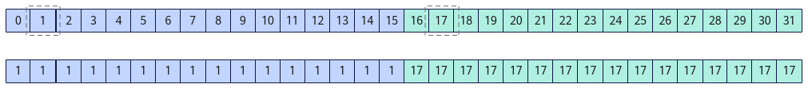

# asc_shfl

> **Section**: 6.3.8.5  
> **PDF Pages**: 3325–3326  

---

<!-- page 3325 -->

产品是否支持

Atlas 训练系列产品x

功能说明

查看Warp内所有线程是否为活跃状态。

返回一个32bit的无符号整数，若Warp内某个线程是活跃（已结束线程是非活跃状态）的，则返回值中与线程LaneId对应的bit位为1，否则为0。Warp内所有活跃线程返回相同的结果。

函数原型

```cpp
inline uint32_t asc_activemask()
```

参数说明

无

返回值说明

32bit的无符号整数：若Warp内某个线程是活跃的，则返回值中与线程LaneId对应的bit位为1，否则为0。

约束说明

无

需要包含的头文件

使用该接口需要包含"simt_api/device_warp_functions.h"头文件。

```cpp
#include "simt_api/device_warp_functions.h"
```

调用示例

SIMD与SIMT混合编程场景：__simt_vf__ __launch_bounds__(1024) inline void KernelActiveMask(__gm__ uint32_t* dst){    int idx = threadIdx.x + blockIdx.x * blockDim.x;    // asc_vf_call参数：dim3{1024, 1, 1}    uint32_t result = asc_activemask(); // 返回值为0xffffffff    dst[idx] = result;}

## 6.3.8.5 asc_shfl

产品支持情况

产品是否支持

Atlas 350 加速卡√

<!-- page 3326 -->

产品是否支持

Atlas A3 训练系列产品/Atlas A3 推理系列产品x

Atlas A2 训练系列产品/Atlas A2 推理系列产品x

Atlas 200I/500 A2 推理产品x

Atlas 推理系列产品AI Corex

Atlas 推理系列产品Vector Corex

Atlas 训练系列产品x

功能说明

获取Warp内指定线程src_lane输入的用于交换的var值；如果目标线程是非活跃状态，获取到寄存器中未初始化的值。其中，参数width用于划分Warp内线程的分组。参数width设置参与交换的32个线程的分组宽度，默认值为32，即所有线程分为1组。

在多个分组场景（width小于32）下，每个分组交换操作是独立的，当前线程获取本组内线程编号为src_lane的var值。如果src_lane小于分组宽度width，src_lane是相对组内起始线程位置的逻辑LaneId；如果src_lane大于等于width，src_lane%width的结果是相对组内起始线程位置的逻辑LaneId。

例如，Warp内32个活跃线程调用asc_shfl(LaneId, 1, 16)接口，每个线程的返回值为当前线程所在分组内线程编号为1的var值。

图6-185 asc_shfl 结果示意图



函数原型

```cpp
inline int32_t asc_shfl(int32_t var, int32_t src_lane, int32_t width = warpSize)inline uint32_t asc_shfl(uint32_t var, int32_t src_lane, int32_t width = warpSize)inline float asc_shfl(float var, int32_t src_lane, int32_t width = warpSize)inline int64_t asc_shfl(int64_t var, int32_t src_lane, int32_t width = warpSize)inline uint64_t asc_shfl(uint64_t var, int32_t src_lane, int32_t width = warpSize)inline half asc_shfl(half var, int32_t src_lane, int32_t width = warpSize)inline half2 asc_shfl(half2 var, int32_t src_lane, int32_t width = warpSize)
```

参数说明

表6-1624参数说明

参数名输入/输出

描述

var输入线程用于交换的输入操作数。
