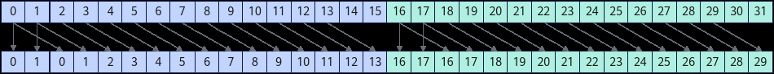

# asc_shfl_up

> **Section**: 6.3.8.6  
> **PDF Pages**: 3327–3328  

---

<!-- page 3327 -->

参数名输入/输出

描述

src_lane

输入期望获取的var值所在线程的LaneId。范围为[0, 32)。

width输入Warp内参与交换的线程的分组宽度，默认值为32。width的取值范围为(0, 32]，width必须是2的倍数。

返回值说明

●Warp内指定线程的var值

●未初始化undefined的值

约束说明

无

需要包含的头文件

使用除half、half2类型之外的接口需要包含"simt_api/device_warp_functions.h"头文件，使用half和half2类型接口需要包含"simt_api/asc_fp16.h"头文件。

```cpp
#include "simt_api/device_warp_functions.h" #include "simt_api/asc_fp16.h"
```

调用示例

SIMD与SIMT混合编程场景：__simt_vf__ __launch_bounds__(1024) void KernelShfl(__gm__ int32_t* dst){    // asc_vf_call参数：dim3{1024, 1, 1}    int idx = threadIdx.x + blockIdx.x * blockDim.x;    int32_t laneId = idx % 32;    // 0-15线程返回值为1，16-31线程返回值为17    int32_t result = asc_shfl(laneId, 1, 16);    dst[idx] = result;}

## 6.3.8.6 asc_shfl_up

产品支持情况

产品是否支持

Atlas 350 加速卡√

Atlas A3 训练系列产品/Atlas A3 推理系列产品x

Atlas A2 训练系列产品/Atlas A2 推理系列产品x

Atlas 200I/500 A2 推理产品x

Atlas 推理系列产品AI Corex

<!-- page 3328 -->

产品是否支持

Atlas 推理系列产品Vector Corex

Atlas 训练系列产品x

功能说明

获取Warp内当前线程向前偏移delta（当前线程LaneId-delta）的线程输入的用于交换的var值；如果目标线程是非活跃状态，获取到寄存器中未初始化的值。其中，参数width用于划分Warp内线程的分组。参数width设置参与交换的32个线程的分组宽度，默认值为32，即所有线程分为1组。

在多个分组场景（width小于32）下，每个分组交换操作是独立的，每个线程获取本组内当前线程向前偏移delta的线程的var值。如果当前线程向前偏移delta的线程编号，即LaneId-delta，小于所在分组的起始LaneId，则返回当前线程的var值。

例如，Warp内32个活跃线程调用asc_shfl_up(LaneId, 2, 16)接口，每个线程的返回值为当前线程LaneId-2对应线程的var值，或者当前线程的var值。

图6-186 asc_shfl_up 结果示意图



函数原型

```cpp
inline int32_t asc_shfl_up(int32_t var, uint32_t delta, int32_t width = warpSize)inline uint32_t asc_shfl_up(uint32_t var, uint32_t delta, int32_t width = warpSize)inline float asc_shfl_up(float var, uint32_t delta, int32_t width = warpSize)inline int64_t asc_shfl_up(int64_t var, uint32_t delta, int32_t width = warpSize)inline uint64_t asc_shfl_up(uint64_t var, uint32_t delta, int32_t width = warpSize)inline half asc_shfl_up(half var, uint32_t delta, int32_t width = warpSize)inline half2 asc_shfl_up(half2 var, uint32_t delta, int32_t width = warpSize)
```

参数说明

表6-1625参数说明

参数名输入/输出

描述

var输入线程用于交换的输入操作数。

delta输入期望获取的var值所在线程相对当前线程的向前偏移值。范围为[0, 32)，且小于width。

width输入Warp内参与交换的线程的分组宽度，默认值为32。width的取值范围为(0, 32]，width必须是2的倍数。
