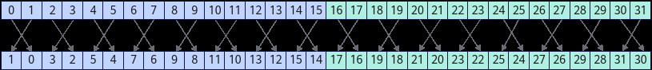

# asc_shfl_xor

> **Section**: 6.3.8.8  
> **PDF Pages**: 3331–3332  

---

<!-- page 3331 -->

返回值说明

●Warp内指定线程的var值

●未初始化undefined的值

约束说明

无

需要包含的头文件

使用除half、half2类型之外的接口需要包含"simt_api/device_warp_functions.h"头文件，使用half和half2类型接口需要包含"simt_api/asc_fp16.h"头文件。

```cpp
#include "simt_api/device_warp_functions.h" #include "simt_api/asc_fp16.h"
```

调用示例

SIMD与SIMT混合编程场景：__simt_vf__ __launch_bounds__(1024) inline void KernelShflDown(__gm__ int32_t* dst){    // asc_vf_call参数：dim3{1024, 1, 1}    int idx = threadIdx.x + blockIdx.x * blockDim.x;    int32_t laneId = idx % 32;    // 0-15线程返回值分别为{2,3,4,5,6,7,8,9,10,11,12,13,14,15,14,15}    // 16-31线程返回值为{18,19,20,21,22,23,24,25,26,27,28,29,30,31,30,31}    int32_t result = asc_shfl_down(laneId, 2, 16);    dst[idx] = result;}

// asc_shfl_down实现reducesum__simt_vf__ __launch_bounds__(1024) inline void KernelShflDownReduceSum(__gm__ int32_t* dst){    int idx = threadIdx.x + blockIdx.x * blockDim.x;    int32_t laneId = idx % 32;    int32_t value = laneId;

```cpp
value += asc_shfl_down(value, 1, 31); // 1    value += asc_shfl_down(value, 2, 31); // 2    value += asc_shfl_down(value, 4, 31); // 4    value += asc_shfl_down(value, 8, 31); // 8    value += asc_shfl_down(value, 16, 31); // 16
dst[idx] = value;}
```

## 6.3.8.8 asc_shfl_xor

产品支持情况

产品是否支持

Atlas 350 加速卡√

Atlas A3 训练系列产品/Atlas A3 推理系列产品x

Atlas A2 训练系列产品/Atlas A2 推理系列产品x

Atlas 200I/500 A2 推理产品x

<!-- page 3332 -->

产品是否支持

Atlas 推理系列产品AI Corex

Atlas 推理系列产品Vector Corex

Atlas 训练系列产品x

功能说明

获取Warp内当前线程LaneId与输入lane_mask做异或操作（LaneId^lane_mask）得到的dstLaneId对应线程输入的用于交换的var值；如果目标线程是非活跃状态，获取到寄存器中未初始化的值。其中，参数width用于划分Warp内线程的分组。参数width设置参与交换的32个线程的分组宽度，默认值为32，即所有线程分为1组。

在多个分组场景（width小于32）下，每个线程获取位于本组内或线程编号更小的组内的dstLaneId对应线程的var值；也就是说，如果dstLaneId小于当前线程所在分组的起始LaneId，dstLaneId对应的线程位于线程编号更小的组内，则可以获取该dstLaneId线程的var值；如果dstLaneId大于当前线程所在分组的最大LaneId，则返回当前线程的var值。

例如，Warp内32个活跃线程调用asc_shfl_xor(LaneId, 1, 16)接口，每个线程的返回值为当前线程LaneId^1对应线程的var值。

图6-188 asc_shfl_xor 结果示意图



函数原型

```cpp
inline int32_t asc_shfl_xor(int32_t var, int32_t lane_mask, int32_t width = warpSize)inline uint32_t asc_shfl_xor(uint32_t var, int32_t lane_mask, int32_t width = warpSize)inline float asc_shfl_xor(float var, int32_t lane_mask, int32_t width = warpSize)inline int64_t asc_shfl_xor(int64_t var, int32_t lane_mask, int32_t width = warpSize)inline uint64_t asc_shfl_xor(uint64_t var, int32_t lane_mask, int32_t width = warpSize)inline half asc_shfl_xor(half var, int32_t lane_mask, int32_t width = warpSize)inline half2 asc_shfl_xor(half2 var, int32_t lane_mask, int32_t width = warpSize)
```

参数说明

表6-1627参数说明

参数名输入/输出

描述

var输入线程用于交换的输入操作数。

lane_mask

输入与当前线程LaneId做异或运算的操作数。取值范围为[0,32)，且小于width。

width输入Warp内参与交换的线程的分组宽度，默认值为32。width的取值范围为(0, 32]，width必须是2的倍数。
