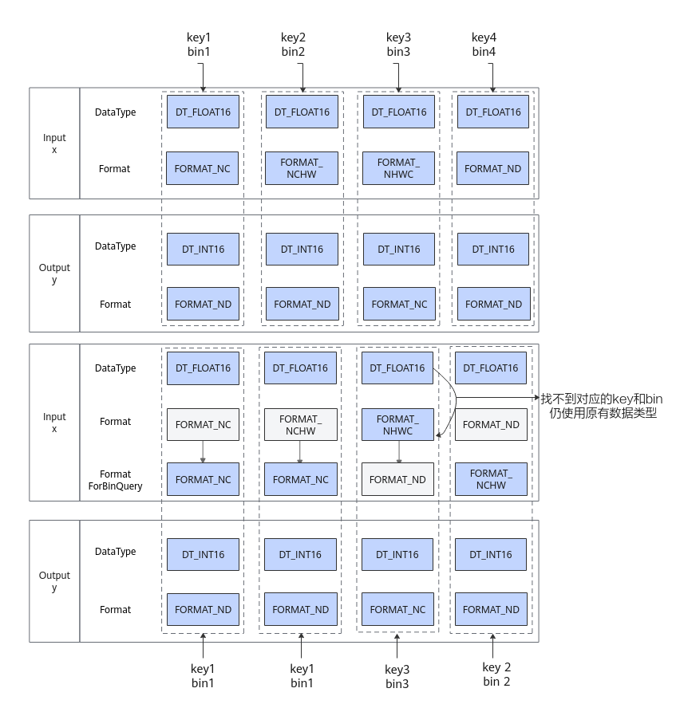

# FormatForBinQuery

> **Section**: 6.4.3.4.7  
> **PDF Pages**: 3791–3793  

---

<!-- page 3791 -->

函数原型

```cpp
OpParamDef &Format(std::vector<ge::Format> formats)
```

参数说明

参数输入/输出说明

formats输入算子参数数据格式。

返回值说明

OpParamDef算子定义，OpParamDef请参考6.4.3.4 OpParamDef。

约束说明

无

## 6.4.3.4.7 FormatForBinQuery

功能说明

设置Input/Output用于运行时算子二进制查找的数据格式，和Format/FormatList的数量一致，且一一对应。

算子编译过程中，会根据数据格式生成多个.o，并通过这些数据格式在运行时索引算子二进制。某些算子支持多种数据格式，且对数据格式不敏感，这时可以使用该接口，将多种数据格式映射到同一个算子二进制，多个数据格式可以复用一个.o，从而减少二进制文件的生成。

例如，如果一个算子的输入支持多种数据格式（ge::FORMAT_NC和ge::FORMAT_ND），并且使用ge::FORMAT_NC输入时可以复用ge::FORMAT_ND的二进制文件而不影响最终结果，那么可以采用如下配置：

```cpp
this->Input("x")            .ParamType(REQUIRED)            .DataType({ge::DT_INT16, ge::DT_INT16})            .Format({ge::FORMAT_NC, ge::FORMAT_ND})            .FormatForBinQuery({ge::FORMAT_ND,ge::FORMAT_ND});
```

这样，只需生成一个目标文件（.o），就能实现对多种数据格式的支持。

函数原型

```cpp
OpParamDef &FormatForBinQuery(std::vector<ge::Format> formats)
```

参数说明

参数输入/输出说明

formats输入算子参数数据格式。

<!-- page 3792 -->

返回值说明

OpParamDef算子定义，OpParamDef请参考6.4.3.4 OpParamDef。

约束说明

●FormatForBinQuery的参数个数需要和当前算子参数的Format或者FormatList的参数个数保持一致。

●不支持与Scalar/ScalarList同时使用。

●不支持与ValueDepend同时使用。

●设置FormatForBinQuery后，会用FormatForBinQuery的数据格式替换当前Input/Output的数据格式，并检查新组合在替换前是否存在。如果存在，则指向对应的二进制，如果不存在，该参数失效，按照原来的数据格式生成。具体请参考示例一。

调用示例

●示例一        this->Input("x")            .ParamType(REQUIRED)            .DataType({ge::DT_FLOAT16, ge::DT_FLOAT16, ge::DT_FLOAT16, ge::DT_FLOAT16})            .Format({ge::FORMAT_NC, ge::FORMAT_NCHW, ge::FORMAT_NHWC, ge::FORMAT_ND})            .FormatForBinQuery({ge::FORMAT_NC, ge::FORMAT_NC, ge::FORMAT_ND, ge::FORMAT_NCHW});        this->Output("y")            .ParamType(REQUIRED)            .DataType({ge::DT_FLOAT, ge::DT_FLOAT, ge::DT_FLOAT, ge::DT_FLOAT})            .Format({ge::FORMAT_ND, ge::FORMAT_ND, ge::FORMAT_NC, ge::FORMAT_ND});

如下图所示，没有设置FormatForBinQuery之前，会生成4个二进制。通过上述代码设置FormatForBinQuery后：

–替换后第4列使用原来第2列的二进制，第1列和第2列使用原来第1列的二进制。第3列仍使用第3列的二进制。

–替换后，第1列和第2列完全一致，达成二进制复用的效果，算子总二进制会由原来的四个（bin1，bin2，bin3，bin4）缩减至现在的三个（bin1，bin2、bin3）。

<!-- page 3793 -->



●示例二        // 简单用例，此时会有两对复用，1、2列->1列，3、4列->4列。总共生成1、4两个二进制。所有支持的Format会传入这两个二进制运行。        this->Input("x")            .ParamType(REQUIRED)            .DataType({ge::DT_FLOAT16, ge::DT_FLOAT16, ge::DT_FLOAT16, ge::DT_FLOAT16})            .Format({ge::FORMAT_NC, ge::FORMAT_NCHW, ge::FORMAT_NHWC, ge::FORMAT_ND})            .FormatForBinQuery({ge::FORMAT_NC, ge::FORMAT_NC, ge::FORMAT_ND, ge::FORMAT_ND});        this->Output("y")            .ParamType(REQUIRED)            .DataType({ge::DT_FLOAT, ge::DT_FLOAT, ge::DT_FLOAT, ge::DT_FLOAT})            .Format({ge::FORMAT_ND, ge::FORMAT_ND, ge::FORMAT_ND, ge::FORMAT_ND});

●示例三        // 复杂用例，可以多个Input/Output同时使用FormatBinQuery，此时也会产生两对复用。1、2列->1列，3、4列->3列。总共生成1、3两个二进制。所有支持的Format会传入这两个二进制运行。        this->Input("x")            .ParamType(REQUIRED)            .DataType({ge::DT_FLOAT16, ge::DT_FLOAT16, ge::DT_FLOAT16, ge::DT_FLOAT16})            .Format({ge::FORMAT_NC, ge::FORMAT_NCHW, ge::FORMAT_NHWC, ge::FORMAT_ND})            .FormatForBinQuery({ge::FORMAT_NC, ge::FORMAT_NC, ge::FORMAT_NHWC, ge::FORMAT_NHWC});        this->Input("y")            .ParamType(REQUIRED)            .DataType({ge::DT_FLOAT16, ge::DT_FLOAT16, ge::DT_FLOAT16, ge::DT_FLOAT16})            .Format({ge::FORMAT_NC, ge::FORMAT_NCHW, ge::FORMAT_NHWC, ge::FORMAT_ND})            .FormatForBinQuery({ge::FORMAT_NC, ge::FORMAT_NC, ge::FORMAT_NHWC, ge::FORMAT_NHWC});
