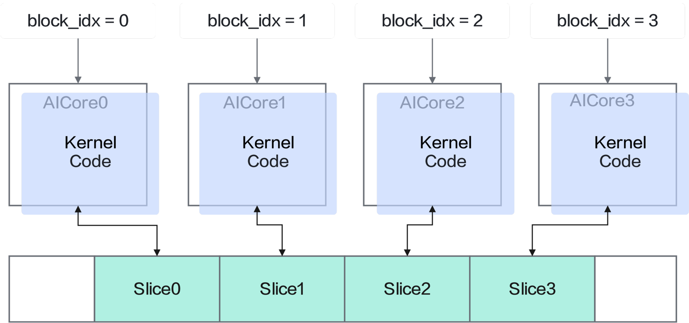

# Kernel 函数 SPMD 并行

> **Section**: 3.3.2


Kernel 函数 block 并行是一种经典的 SPMD 并行编程范式。简而言之， Single Program 表明不同 Kernel 实例执行的是同一份二进制代码， Multiple Data 表明每个 Kernel 实例 处理不同的数据块，从而这些 Kernel 实例可以被分发到不同的物理核上去执行，并且 通常情况下不感知 Kernel 实例调度执行的顺序。

## 图 3-3 SPMD 示意图



**[Image: figure_0111.png (1577x741, 119.6KB)]**

```
__global__ [aicore] void foo(__gm__ int *Buffer, int SliceSize) { // 示意程序，往每个数据分片的第一个 DWORD 写一个整型值 Buffer[block_idx * SliceSize] = block_idx; }
```

每个 Kernel 实例拥有一个唯一的 block\_idx 内建变量，由 Runtime 在加载 Kernel 函数的 时候根据配置的 BlockNum 产生，其值为 {0 ， 1 ， 2 ， ..., BlockNum - 1} 。因此，每个 Kernel 实例拥有了自己的执行实例，除了用于索引每个 block 独立的数据分片，也可以 控制 kernel 实例的执行路径。

```
__global__ [aicore] void foo() { if (block_idx % 2 == 0) { // even block_idx execute this path } else { // odd block_idx execute this path } }
```

如图 2 昇 腾程序运行模型所示，并行执行的 AICORE 核拥有完整独立的上下文，含独立 PC 、 Register File 等。
