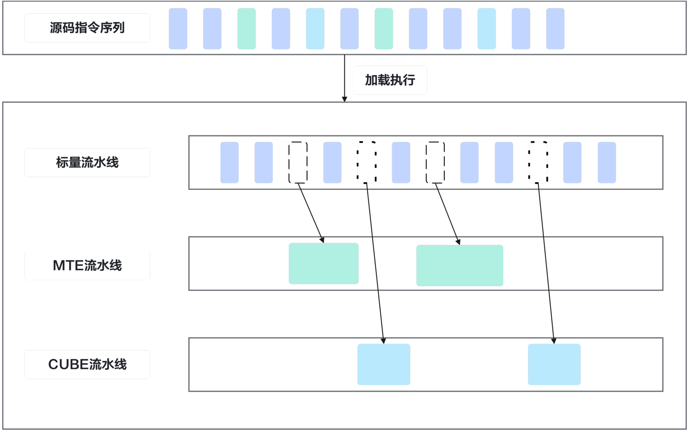

# Kernel 内多流水异步并行

> **Section**: 3.3.3

昇 腾芯片核内采用异步多流水线设计，主要包含以下几类指令流水线：

- 标量执行单元，负责标量计算和程序控制流等，也负责发射异步 DSA 指令
- CUBE 执行单元
- Vector 执行单元
- MTE 执行单元

图 3-4 多流水异步执行示意图

**[Image: figure_0122.png (1580x992, 77.2KB)]**

函数执行空间限定符

地址空间限定符

预定义宏

全局变量

标量
