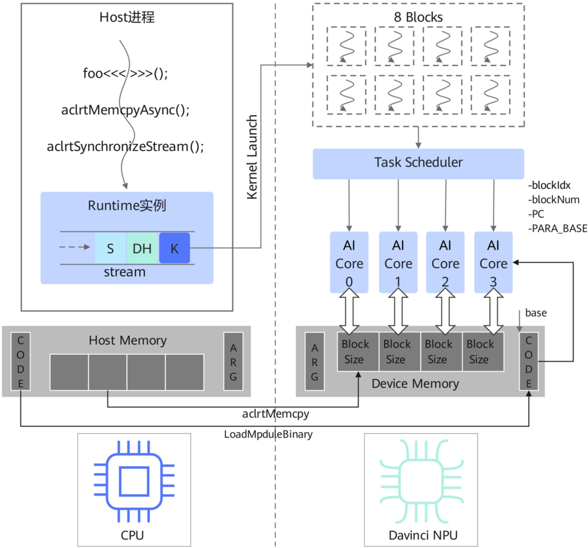

# CCE Intrinsic 介绍

> **Section**: 3


```
// QuickStartDemoACL.cce #include "acl/acl.h" #include <stdio.h> #include <stdlib.h> #define BLOCKS 4 #define CACHELINE_SZ 64 // Define a kernel __global__[aicore] void foo(__gm__ uint8_t *Out, int Stride) { Out[block_idx * Stride] = block_idx; } int main(int argc, char *argv[]) { aclInit(nullptr); aclrtSetDevice(0); aclrtStream stream; aclrtCreateStream(&stream); uint8_t ExpectedValue[] = {0, 1, 2, 3}; uint8_t *OutputValue = nullptr; aclrtMalloc((void **)&OutputValue, BLOCKS, ACL_MEM_MALLOC_NORMAL_ONLY); uint8_t InitValue[BLOCKS] = {0}; aclrtMemcpyAsync((void *)OutputValue, sizeof(InitValue), InitValue, sizeof(InitValue), ACL_MEMCPY_HOST_TO_DEVICE, stream); aclrtSynchronizeStream(stream); // Invoke a kernel, with BLOCKS number of logical blocks foo<<<BLOCKS, nullptr, stream>>>(OutputValue, CACHELINE_SZ); uint8_t *OutHost = nullptr; aclrtMallocHost((void **)&OutHost, BLOCKS * CACHELINE_SZ); aclrtMemcpyAsync(OutHost, BLOCKS * CACHELINE_SZ, OutputValue, BLOCKS * CACHELINE_SZ, ACL_MEMCPY_DEVICE_TO_HOST, stream); aclrtSynchronizeStream(stream); for (int I = 0; I < sizeof(ExpectedValue) / sizeof(uint8_t); I++) { printf("i%d\t Expect: 0x%04x\t\t\t\tResult: 0x%04x\n", I, ExpectedValue[I], OutHost[I * CACHELINE_SZ]); } aclrtFreeHost(OutHost); aclrtFree(OutputValue); aclrtDestroyStream(stream); aclrtResetDevice(0); aclFinalize(); return 0; }
```

如上用例， CCE 程序通过 \_\_global\_\_ 关键字标识设备侧入口函数（ Kernel 函数），通过 &lt;&lt;&lt;&gt;&gt;&gt; 异构调用语法执行 Kernel 函数。 &lt;&lt;&lt;BlockNum, SmDesc, Stream&gt;&gt;&gt; 总共包含 三个可配置参数，其中第一个参数指定 Kernel 函数运行的实例化份数，第二个参数用 于配置片上 L2 缓存的使用，第三个参数用于具体绑定执行该 Kernel 的 Stream 队列。上 述用例中， foo 函数为 Device 侧代码， main 函数为 Host 侧代码。

## 注意事项

## 图 3-2 昇 腾程序运行模型



**[Image: figure_0079.png (1523x1420, 330.1KB)]**

## CCE 异构程序的具体运行模式如上图所示，主要步骤包括：

1. 主机侧将 Kernel 参数经由 Runtime 以特定方式传递到设备侧内存。
2. 主机侧将 Kernel 任务通过 Runtime 提交到运行队列 stream 中。
3. 主机侧 API 返回。
4. 设备侧获取待运行 kernel 任务信息，关键信息为 BlockNum 、 Kernel 代码基址、 Kernel 参数基址等。
5. AICore 硬件调度器根据 BlockNum 实例化具体任务给每一个 AICore, 分配实例 Id: block\_idx 。
6. 调度器将 Kernel 具体运行所需的信息配置给待执行任务的空闲 AICore 核。
7. AICore 核心从配置的 PC 开始执行程序。
8. 调度器等待所有 BlockNum 个实例执行完成。
9. 异步 kernel 调用执行完成。

如果 BlockNum 数大于硬件核数，调度器将以多批次派发的方式执行完所有任务。但是 单个 AICore 物理核不支持多个 Block 同时并行执行，也不支持 Context Switch ，请按照 以下建议配置：

1. 多 Block 间如果有全同步等操作，配置逻辑核数不大于物理核数，否则会造成死锁。
2. 建议 BlockNum 配置为物理核的整数倍，避免产生空闲核。
