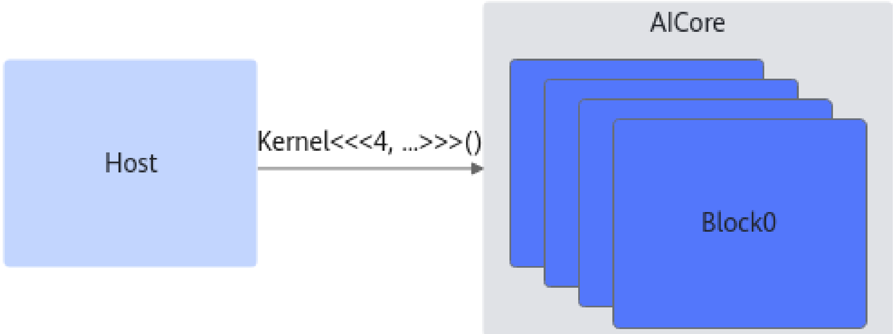

# 异构编程

> **Section**: 3.1

基于 昇 腾多核并行架构， CCE 编程提供了显式 Host+Device 异构编程。 Kernel 函数是一 种 SPMD （ Single Program Multiple Data ）的并行编程模型，直观地映射了芯片的多 核并行能力。针对 昇 腾 DSA （ Domain Specific Architecture ）加速指令，提供底层 intrinsic 接口访问硬件加速能力。

CCE 异构编程秉承最小化扩展原则，基于 C++ 语言的扩展，将达芬奇原生机器模型和编 程模型映射到高级语言。 CCE 异构编程语法主要扩展包括异构函数执行空间，地址空 间，异构调用语法三部分；并行编程模型扩展主要包括编译器内建变量，如 block\_idx, block\_dim 等。完整的 CCE 异构编程需配套使用 ACL 运行时库， ACL 运行时 API 请参考 《 Runtime 运行时 API 》文档。

异构编程允许源码文件同时包含运行于主机侧和设备侧的执行代码，但是设备侧芯片 主要用于特定领域的加速计算，因此通常和主机侧具备完全不同的微架构和指令集。 异构编程中， Host 运行在主机侧，负责控制和调度； Device 运行在 AICore ，负责执 行高性能计算。异构编程通过显式的函数执行空间区分主机代码和设备代码，并基于 异构函数语义隐藏复杂的 Host 和 Device 交互 ABI 。

图 3-1 异构调用

**[Image: figure_0072.png (1483x556, 33.5KB)]**
