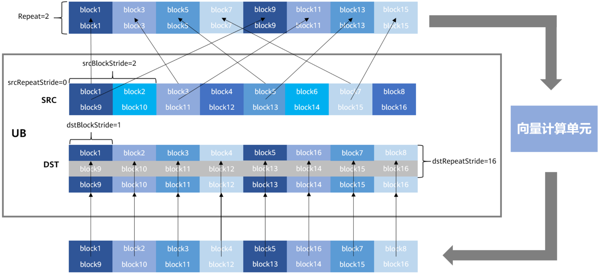

# 单目与双目模板参数说明

> **Section**: 6.3.1.1

Vector intrinsic 接口在 Vector 计算单元执行，源操作数和目的操作数均通过 Unified Buffer （ UB ）来进行存储。大多数情况下， Vector 计算单元每个迭代会从 UB 中取出 8 个 datablock （每个 datablock 数据块内部地址连续，长度 32Byte ，合计 256Byte ）进 行计算，并写入对应的 8 个 datablock 中。涉及数据类型转换的接口存在一些例外情 况，将在对应章节中详述。

下图展示了一个基本向量计算的行为模式。

图 6-1 向量计算示意图

**[Image: figure_0663.png (1587x727, 214.0KB)]**

- Repeat ：通过 Repeat 来配置迭代次数，从而控制接口的多次迭代执行。如上图 Repeat 设置为 2 ，矢量计算单元会进行 2 个迭代的计算，可计算出 2 * 8 （每个迭代 8 个 datablock ） * 32Byte （每个 datablock 32Byte ） = 512Byte 的结果。由于硬 件限制， Repeat 不能超过 255 ，如果 Repeat 设置为 0 ，则接口视为 NOP 接口。
- RepeatStride ：代表每次迭代之间的起始间隔，上图 srcRepeatStride 设置为 0 ， 表示每个迭代都从同一个地址读取数据。 dstRepeatStride 均设置为 16 ，即两次迭 代的目的地址起始地址间隔为 16 * 32Byte 。如果接口一次迭代处理 8 个 block ，将 dstRepeatStride/srcRepeatStride 设置为 8 ，表示下一个迭代比上一个迭代间隔 8 个 block ，两次迭代的起始地址间隔 8 * 32Byte ，进行多次迭代时将连续地处理数 据。
- BlockStride ：代表每个 Repeat 计算中读取的 8 个 block 的间隔，如上图中 srcBlockStride 设置为 2 ，则表示连续读取的两个 block 的起始地址间隔为 2 个 block （即 64Byte ），而 dstBlockStride 设置为 1 ，则运算结果的 8 个 block 连续存 放。

根据计算所需的源操作数的个数可分为表 1 单目运算参数说明和表 2 双目运算参数说 明。

表 6-1 单目运算参数说明

| 参数名    | 说明          | 取值范围       | 单位   |
|--------|-------------|------------|------|
| dst    | 目的操作数起始地 址。 | /          | /    |
| src    | 源操作数起始地 址。  | /          | /    |
| repeat | 接口迭代次数。     | [0, 2^8-1] | /    |

| 参数名             | 说明                                                                                                | 取值范围        | 单位   |
|-----------------|---------------------------------------------------------------------------------------------------|-------------|------|
| dstBlockStride  | 同一次执行中，目 的操作数不同 block 首地址间地 址步长。例如，当 dstBlockStride 为 3 ，每个 dst block 的起始地址间隔为 3 个 block(3*32B) 。 | [0, 2^16-1] | 32B  |
| srcBlockStride  | 同一次执行中，源 操作数不同 block 首 地址间地址步长。                                                                   | [0, 2^16-1] | 32B  |
| dstRepeatStride | 相邻两次执行间， 目的操作数相同 block 首地址间地址 步长。 0 表示两次 迭代的所有对应块 指向相同的地址。                                        | [0, 2^12-1] | 32B  |
| srcRepeatStride | 相邻两次执行间， 源操作数相同 block 首地址间地址步 长。                                                                  | [0, 2^12-1] | 32B  |

## 表 6-2 双目运算参数说明

| 参数名              | 说明                                                                                               | 取值范围       | 单位   |
|------------------|--------------------------------------------------------------------------------------------------|------------|------|
| dst              | 目的操作数起始地址。                                                                                       | /          | /    |
| src0             | 源操作数 0 起始地址。                                                                                     | /          | /    |
| src1             | 源操作数 1 起始地址。                                                                                     | /          | /    |
| repeat           | 接口迭代次数。                                                                                          | [0, 2^8-1] | /    |
| dstBlockSt ride  | 同一次执行中，目的操作数不同 block 首地址间地址步长。例如， 当 dstBlockStride 为 3 ，每个 dst block 的起始地址间隔为 3 个 block(3*32B) 。 | [0, 2^8-1] | 32B  |
| src0Block Stride | 同一次执行中，源操作数 0 不同 block 首地址间地址步长。                                                                 | [0, 2^8-1] | 32B  |
| src1Block Stride | 同一次执行中，源操作数 1 不同 block 首地址间地址步长。                                                                 | [0, 2^8-1] | 32B  |
