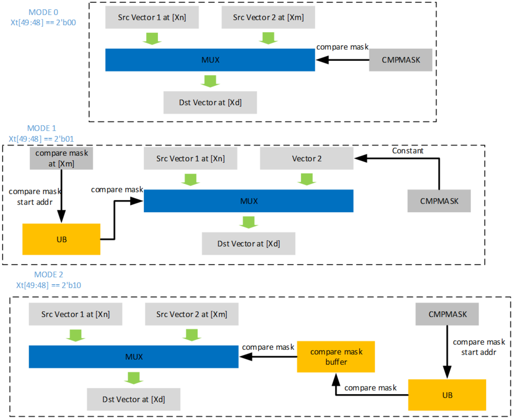

# vsel

> **Section**: 6.3.7.1

## 功能说明

根据 selectMode ，选择对应输出。

selectMode 为 0 时，该接口根据存储在 SPR CMPMASK 中的比较掩码（可以通过 set\_cmpmask() 设置），在 src0 和 src1 向量之间进行 2 选 1 选择。对于类型 f16 ， CMPMASK[127:0] 有效；对于类型 f32 ， CMPMASK[63:0] 有效。如果某一位为 1 ，则 目标元素（ f16 或 f32 ）来自 src0 ，否则来自 src1 。

selectMode 为 1 时，该接口根据存储在 UB 中起始地址为 src1 的比较掩码，在 src0 和一个常数之间进行逐元素选择。注意， src1 指向的内存不是掩码的具体值，而是掩 码的起始地址。对于 f16 类型，常数由 CMPMASK[15:0] 表示；对于 f32 类型，常数 由 CMPMASK[31:0] 表示。该接口仍遵循双目运算操作数模板，但 src1 的 src1BlockStride 不生效，默认 UB 中所有 CMPMASK 是连续存储的，即 src1BlockStride 的重复步长为 16B （ f16 类型）或 8B （ f32 类型）。对于 f32 类型，一 个比较掩码的长度为 64 位；对于 f16 类型，一个比较掩码的长度为 128 位。比较掩码 的起始地址应为 32B 对齐。如果某一位为 1 ，则目标元素（ f16 或 f32 ）来自 src0 ，否则 来自该常数。

selectMode 为 2 时，该接口根据存储在 UB 中的比较掩码，在 src0 和 src1 向量之间 进行 2 选 1 选择，其起始地址由 SPR CMPMASK 指示（规则类似 Mode1 中的 src1 ）。 在选择操作之前，根据起始地址从 UB 中获取多个比较掩码到本地缓冲区。该接口会 根据本地存储的比较掩码在 src0 和 src1 之间反复进行 2 选 1 选择，直到所有比较掩码被 消耗完毕。之后，自动发起另一次 UB 访问以获取新的比较掩码。比较掩码的起始地址 应为 32B 对齐，并且所有比较掩码在 UB 中是连续存储的。如果某一位为 1 ，则目标元素 （ f16 或 f32 ）来自 src0 ，否则来自 src1 。

流程图示如下，其中 Xt[49:48] 对应 selectMode ， [Xn] 对应 src0 ， [Xm] 对应 src1 ， [Xd] 对应 dst 。

该接口支持 MASK 配置。如果 MASK 的一个位置为 0 ，则 dst 对应的位置保持不变，不 写入。

## 接口原型

## 参数说明

**[Image: figure_1181.png (1516x1236, 228.8KB)]**

// 相同接口的不同原型区别在于源地址和目的地址的数据类型不同 // src1 指向的数据类型在不同 selectMode 配置下有变化，提供 void 指针类型的接口 void vsel(\_\_ubuf\_\_ half *dst, \_\_ubuf\_\_ half *src0, \_\_ubuf\_\_ void *src1, uint8\_t repeat, uint8\_t dstBlockStride, uint8\_t src0BlockStride, uint8\_t src1BlockStride, uint8\_t dstRepeatStride, uint8\_t src0RepeatStride, uint8\_t src1RepeatStride, uint8\_t selectMode);

void vsel(\_\_ubuf\_\_ float *dst, \_\_ubuf\_\_ float *src0, \_\_ubuf\_\_ void *src1, uint8\_t repeat, uint8\_t dstBlockStride, uint8\_t src0BlockStride, uint8\_t src1BlockStride, uint8\_t dstRepeatStride, uint8\_t src0RepeatStride, uint8\_t src1RepeatStride, uint8\_t selectMode);

## 参数含义见 表 2 双目运算参数说明。

表 6-11 vsel 特有参数说明

| 参数名         | 说明                                                                                                                                                |
|-------------|---------------------------------------------------------------------------------------------------------------------------------------------------|
| selectMod e | 选择模式： ● 0 ：根据 CMPMASK 信息，在 src0 和 src1 间选取。 ● 1 ：根据 src1 间接寻址的 MASK ，在 src0 和（ CMPMASK 存储的） 常数间选取。 ● 2 ：根据 CMPMASK 间接寻址的 MASK ，在 src0 和 src1 间选取。 |

## 流水类型

PIPE\_V
