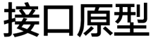
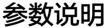

# vcmpv

> **Section**: 6.3.8.4

## 功能说明

src0BlockStride, uint8\_t src1BlockStride, uint8\_t dstRepeatStride, uint8\_t src0RepeatStride, uint8\_t src1RepeatStride);

## // vcmp\_le

void vcmp\_le(\_\_ubuf\_\_ half *src0, \_\_ubuf\_\_ half *src1, uint8\_t repeat, uint8\_t dstBlockStride, uint8\_t src0BlockStride, uint8\_t src1BlockStride, uint8\_t dstRepeatStride, uint8\_t src0RepeatStride, uint8\_t src1RepeatStride);

void vcmp\_le(\_\_ubuf\_\_ float *src0, \_\_ubuf\_\_ float *src1, uint8\_t repeat, uint8\_t dstBlockStride, uint8\_t src0BlockStride, uint8\_t src1BlockStride, uint8\_t dstRepeatStride, uint8\_t src0RepeatStride, uint8\_t src1RepeatStride);

void vcmp\_le(\_\_ubuf\_\_ uint16\_t *src0, \_\_ubuf\_\_ uint16\_t *src1, uint8\_t repeat, uint8\_t dstBlockStride, uint8\_t src0BlockStride, uint8\_t src1BlockStride, uint8\_t dstRepeatStride, uint8\_t src0RepeatStride, uint8\_t src1RepeatStride);

## // vcmp\_ge

void vcmp\_ge(\_\_ubuf\_\_ half *src0, \_\_ubuf\_\_ half *src1, uint8\_t repeat, uint8\_t dstBlockStride, uint8\_t src0BlockStride, uint8\_t src1BlockStride, uint8\_t dstRepeatStride, uint8\_t src0RepeatStride, uint8\_t src1RepeatStride);

void vcmp\_ge(\_\_ubuf\_\_ float *src0, \_\_ubuf\_\_ float *src1, uint8\_t repeat, uint8\_t dstBlockStride, uint8\_t src0BlockStride, uint8\_t src1BlockStride, uint8\_t dstRepeatStride, uint8\_t src0RepeatStride, uint8\_t src1RepeatStride);

void vcmp\_ge(\_\_ubuf\_\_ uint16\_t *src0, \_\_ubuf\_\_ uint16\_t *src1, uint8\_t repeat, uint8\_t dstBlockStride, uint8\_t src0BlockStride, uint8\_t src1BlockStride, uint8\_t dstRepeatStride, uint8\_t src0RepeatStride, uint8\_t src1RepeatStride);

参数含义见 表 2 双目运算参数说明。

PIPE\_V

逐元素比较向量 src0 与向量 src1 的每个元素，如果比较后的结果为真，则输出结果 的对应比特位为 1 ，否则为 0 。

元素类型为 f16 时，向量中元素个数为 128 ，因此结果是一个连续的 128bit ，写入 dst 中，重复计算时，新的 dst = dst + 16Bytes 。

元素类型为 f32 时，向量中元素个数为 64 ，因此结果是一个连续的 64bit ，写入 dst 中， 重复计算时，新的 dst = dst + 8Bytes 。

## 支持多种比较接口：

- EQ ：

src0 等于 src1 （ equal to ）

- NE ：

src0 不等于 src1 （ not equal to ）

- LT ：

src0 小于 src1 （ less than ）

● GT ： src0 大于 src1 （ greater than ）

- LE ： src0 小于或等于 src1 （ less than or equal to

）

- GE ：

src0 大于或等于 src1 （ greater than or equal to ）

int32 类型只支持 eq 接口。

**[Image: figure_1309.png (214x54, 5.8KB)]**

**[Image: figure_1310.png (212x58, 8.3KB)]**

## 该接口无 MASK 参数。

## // 相同接口的不同原型区别在于源地址和目的地址的数据类型不同

void vcmpv\_eq(\_\_ubuf\_\_ uint8\_t *dst, \_\_ubuf\_\_ half *src0, \_\_ubuf\_\_ half *src1, uint8\_t repeat, uint8\_t dstBlockStride, uint8\_t src0BlockStride, uint8\_t src1BlockStride, uint8\_t dstRepeatStride, uint8\_t src0RepeatStride, uint8\_t src1RepeatStride);

## // vcmpv\_eq

void vcmpv\_eq(\_\_ubuf\_\_ uint8\_t *dst, \_\_ubuf\_\_ float *src0, \_\_ubuf\_\_ float *src1, uint8\_t repeat, uint8\_t dstBlockStride, uint8\_t src0BlockStride, uint8\_t src1BlockStride, uint8\_t dstRepeatStride, uint8\_t src0RepeatStride, uint8\_t src1RepeatStride);

void vcmpv\_eq(\_\_ubuf\_\_ uint8\_t *dst, \_\_ubuf\_\_ int32\_t *src0, \_\_ubuf\_\_ int32\_t *src1, uint8\_t repeat, uint8\_t dstBlockStride, uint8\_t src0BlockStride, uint8\_t src1BlockStride, uint8\_t dstRepeatStride, uint8\_t src0RepeatStride, uint8\_t src1RepeatStride);

## // vcmpv\_ne

void vcmpv\_ne(\_\_ubuf\_\_ uint8\_t *dst, \_\_ubuf\_\_ half *src0, \_\_ubuf\_\_ half *src1, uint8\_t repeat, uint8\_t dstBlockStride, uint8\_t src0BlockStride, uint8\_t src1BlockStride, uint8\_t dstRepeatStride, uint8\_t src0RepeatStride, uint8\_t src1RepeatStride);

void vcmpv\_ne(\_\_ubuf\_\_ uint8\_t *dst, \_\_ubuf\_\_ float *src0, \_\_ubuf\_\_ float *src1, uint8\_t repeat, uint8\_t dstBlockStride, uint8\_t src0BlockStride, uint8\_t src1BlockStride, uint8\_t dstRepeatStride, uint8\_t src0RepeatStride, uint8\_t src1RepeatStride);

## // vcmpv\_lt

void vcmpv\_lt(\_\_ubuf\_\_ uint8\_t *dst, \_\_ubuf\_\_ half *src0, \_\_ubuf\_\_ half *src1, uint8\_t repeat, uint8\_t dstBlockStride, uint8\_t src0BlockStride, uint8\_t src1BlockStride, uint8\_t dstRepeatStride, uint8\_t src0RepeatStride, uint8\_t src1RepeatStride);

void vcmpv\_lt(\_\_ubuf\_\_ uint8\_t *dst, \_\_ubuf\_\_ float *src0, \_\_ubuf\_\_ float *src1, uint8\_t repeat, uint8\_t dstBlockStride, uint8\_t src0BlockStride, uint8\_t src1BlockStride, uint8\_t dstRepeatStride, uint8\_t src0RepeatStride, uint8\_t src1RepeatStride);

## // vcmpv\_gt

void vcmpv\_gt(\_\_ubuf\_\_ uint8\_t *dst, \_\_ubuf\_\_ half *src0, \_\_ubuf\_\_ half *src1, uint8\_t repeat, uint8\_t dstBlockStride, uint8\_t src0BlockStride, uint8\_t src1BlockStride, uint8\_t dstRepeatStride, uint8\_t src0RepeatStride, uint8\_t src1RepeatStride);

void vcmpv\_gt(\_\_ubuf\_\_ uint8\_t *dst, \_\_ubuf\_\_ float *src0, \_\_ubuf\_\_ float *src1, uint8\_t repeat, uint8\_t dstBlockStride, uint8\_t src0BlockStride, uint8\_t src1BlockStride, uint8\_t dstRepeatStride, uint8\_t src0RepeatStride, uint8\_t src1RepeatStride);

## // vcmpv\_le

void vcmpv\_le(\_\_ubuf\_\_ uint8\_t *dst, \_\_ubuf\_\_ half *src0, \_\_ubuf\_\_ half *src1, uint8\_t repeat, uint8\_t dstBlockStride, uint8\_t src0BlockStride, uint8\_t src1BlockStride, uint8\_t dstRepeatStride, uint8\_t src0RepeatStride, uint8\_t src1RepeatStride);

void vcmpv\_le(\_\_ubuf\_\_ uint8\_t *dst, \_\_ubuf\_\_ float *src0, \_\_ubuf\_\_ float *src1, uint8\_t repeat, uint8\_t dstBlockStride, uint8\_t src0BlockStride, uint8\_t src1BlockStride, uint8\_t dstRepeatStride, uint8\_t src0RepeatStride, uint8\_t src1RepeatStride);

## // vcmpv\_ge

void vcmpv\_ge(\_\_ubuf\_\_ uint8\_t *dst, \_\_ubuf\_\_ half *src0, \_\_ubuf\_\_ half *src1, uint8\_t repeat, uint8\_t dstBlockStride, uint8\_t src0BlockStride, uint8\_t src1BlockStride, uint8\_t dstRepeatStride, uint8\_t src0RepeatStride, uint8\_t src1RepeatStride);

void vcmpv\_ge(\_\_ubuf\_\_ uint8\_t *dst, \_\_ubuf\_\_ float *src0, \_\_ubuf\_\_ float *src1, uint8\_t repeat, uint8\_t dstBlockStride, uint8\_t src0BlockStride, uint8\_t src1BlockStride, uint8\_t dstRepeatStride, uint8\_t src0RepeatStride, uint8\_t src1RepeatStride);

参数含义见 表 2 双目运算参数说明。

## 流水类型

PIPE\_V
