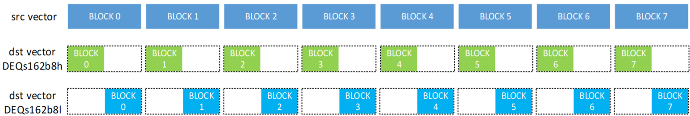

# vconv

> **Section**: 6.3.10.1


## 功能说明

vector 数据类型转换，接口形如 vconv\_bf162f32/vconv\_bf162f32a 后缀区分不同舍 入模式：

- R ：四舍五入，偶数优先（ C 语言中的 rint ）

- A ：四舍五入，中间值向远离零的方向取整（ C 语言中的 round ）

- F ：向下取整（ C 语言中的 floor ）

- C ：向上取整（ C 语言中的 ceil ）

- Z ：向零取整（ C 语言中的 trunc ）

- O ：向奇数取整（冯 · 诺依曼舍入）

留空（ null ）默认为 R 模式。

该接口主要遵循单目运算模板。

该接口涉及不同宽度的类型转换，因此，源操作数和目的操作数 RepeatStride 不总是 常见的 8 个块。接口以其中宽度较大的数据类型为准，由于转换前后元素个数是不变 的，数据宽度更大的类型 RepeatStride 为 8Block ，而宽度较小的类型 RepeatStride 将小于 8Block 。

例如， f162s8 转换接口处理 128 个 f16 元素和 128 个 s8 元素，源操作数有 8 个块，目的操 作数有 4 个块（而非常见的 8 个）。模板中对目标操作数的步幅和偏移定义在此仍然有 效。反之，在 f322s64 接口中，源向量只有 4 个块，而目标向量则有 8 个块。

该接口支持 MASK 配置。 MASK 可控制哪些元素参与计算。

## 支持的数据类型及舍入模式如下表：

| src   | dst   | rounding mode      |
|-------|-------|--------------------|
| f32   | f32   | R/A/F/C/Z          |
| f32   | f16   | (null)/R/A/F/C/Z/O |
| f32   | bf16  | R/A/F/C/Z          |
| f32   | s64   | R/A/F/C/Z          |
| f32   | s32   | R/A/F/C/Z          |
| f32   | s16   | R/A/F/C/Z          |
| f16   | s32   | R/A/F/C/Z          |
| f16   | s16   | R/A/F/C/Z          |
| f16   | s8    | (null)/R/A/F/C/Z   |
| f16   | u8    | (null)/R/A/F/C/Z   |
| f16   | s4    | (null)/R/A/F/C/Z   |

| src         | dst   | rounding mode    |
|-------------|-------|------------------|
| bf16        | s32   | R/A/F/C/Z        |
| s16         | f16   | (null)/R/A/F/C/Z |
| s32         | f32   | (null)/R/A/F/C/Z |
| s64         | f32   | R/A/F/C/Z        |
| DEQs162b8h  | /     | /                |
| DEQs162b8l  | /     | /                |
| VDEQs162b8h | /     | /                |
| VDEQs162b8l | /     | /                |

## DEQ/VDEQ 功能说明

部分类型转换接口涉及 DEQ/VDEQ ，其功能是反量化。

DEQS162B8H/L 中： DEQSCALE[31:0] 表示为 M （在 f32 中表示，硬件将其视为 (1, 8, 10) 格式进行计算，即 1 位符号位、 8 位指数位和 10 位尾数位）。 DEQSCALE[45:37] 表示为 offset （ s9 格式）。 DEQSCALE[46] 用于指示量化结果是 有符号还是无符号。 DEQSCALE 中的其他位为保留位。

## 流程如下：

```
deq_factor[63:0] = DEQSCALE[63:0]; M[31:0] = deq_factor[31:0]; offset[8:0] = deq_factor[45:37]; deqs162b8_quantization(deq_factor, src_s16){ tmp0[31:0] = s16_to_f32(src_s16); tmp1[31:0] = tmp0[31:0] * M; tmp2[8:0] = f32_to_s9_saturation(tmp1[31:0]); tmp3[8:0] = tmp2[8:0] + offset[8:0]; result[7:0] = deq_factor[46] ? s8_saturation(tmp3[8:0]) : u8_saturation(tmp3[8:0]); }
```

s8\_saturation/u8\_saturation 表现如下表：

| val[8:0] signed   | >=0      | >=0       | <0         | <0       |
|-------------------|----------|-----------|------------|----------|
| to s8             | <127     | >=127     | <=-128     | >-128    |
|                   | val[7:0] | 127(0x7F) | -128(0x80) | val[7:0] |
| to u8             | <255     | >=255     | 0          | 0        |
|                   | val[7:0] | 255(0xFF) |            |          |

VDEQS162B8H/L 中： DEQSCALE 用作指向存储在 UB 中的实际量化向量的指针（间 接寻址）。该量化向量是一个包含 16 个元素的 128 字节向量（ 16 个 64 位数字）。 DEQSCALE[13:0] 是 UB 中 128 字节反量化向量的地址，单位为 32Byte 。 将量化向 量的每个 64 位元素表示为 deq\_factor[i][63:0] ，做以下操作：

## 参数说明

## 接口原型

for(i = 0; i &lt; 16; i++){ deq\_factor[i] = *((uint64\_t*)(DEQSCALE[13:0] * 32) + i); deqs162b8\_quantization(deq\_factor[i], s16\_element[i]); }

## DEQ 接口中的 h/l 控制 u8/s8 是落在 bolck 的高位还是低位，如下图所示。



**[Image: figure_1446.png (1546x260, 150.3KB)]**

## 参数含义见 表 1 单目运算参数说明。

// 通用的接口命名方式 vconv\_{src}2{dst}{rnd\_mode}

## // bf162s32

void vconv\_bf162s32a(\_\_ubuf\_\_ int32\_t *dst, \_\_ubuf\_\_ bfloat16\_t *src, uint8\_t repeat, uint16\_t dstBlockStride, uint16\_t srcBlockStride, uint16\_t dstRepeatStride, uint16\_t srcRepeatStride);

void vconv\_bf162s32c(\_\_ubuf\_\_ int32\_t *dst, \_\_ubuf\_\_ bfloat16\_t *src, uint8\_t repeat, uint16\_t dstBlockStride, uint16\_t srcBlockStride, uint16\_t dstRepeatStride, uint16\_t srcRepeatStride);

void vconv\_bf162s32f(\_\_ubuf\_\_ int32\_t *dst, \_\_ubuf\_\_ bfloat16\_t *src, uint8\_t repeat, uint16\_t dstBlockStride, uint16\_t srcBlockStride, uint16\_t dstRepeatStride, uint16\_t srcRepeatStride);

void vconv\_bf162s32r(\_\_ubuf\_\_ int32\_t *dst, \_\_ubuf\_\_ bfloat16\_t *src, uint8\_t repeat, uint16\_t dstBlockStride, uint16\_t srcBlockStride, uint16\_t dstRepeatStride, uint16\_t srcRepeatStride);

void vconv\_bf162s32z(\_\_ubuf\_\_ int32\_t *dst, \_\_ubuf\_\_ bfloat16\_t *src, uint8\_t repeat, uint16\_t dstBlockStride, uint16\_t srcBlockStride, uint16\_t dstRepeatStride, uint16\_t srcRepeatStride);

## // f162s16

void vconv\_f162s16a(\_\_ubuf\_\_ int16\_t *dst, \_\_ubuf\_\_ half *src, uint8\_t repeat, uint16\_t dstBlockStride, uint16\_t srcBlockStride, uint16\_t dstRepeatStride, uint16\_t srcRepeatStride);

void vconv\_f162s16c(\_\_ubuf\_\_ int16\_t *dst, \_\_ubuf\_\_ half *src, uint8\_t repeat, uint16\_t dstBlockStride, uint16\_t srcBlockStride, uint16\_t dstRepeatStride, uint16\_t srcRepeatStride);

void vconv\_f162s16f(\_\_ubuf\_\_ int16\_t *dst, \_\_ubuf\_\_ half *src, uint8\_t repeat, uint16\_t dstBlockStride, uint16\_t srcBlockStride, uint16\_t dstRepeatStride, uint16\_t srcRepeatStride);

void vconv\_f162s16r(\_\_ubuf\_\_ int16\_t *dst, \_\_ubuf\_\_ half *src, uint8\_t repeat, uint16\_t dstBlockStride, uint16\_t srcBlockStride, uint16\_t dstRepeatStride, uint16\_t srcRepeatStride);

void vconv\_f162s16z(\_\_ubuf\_\_ int16\_t *dst, \_\_ubuf\_\_ half *src, uint8\_t repeat, uint16\_t dstBlockStride, uint16\_t srcBlockStride, uint16\_t dstRepeatStride, uint16\_t srcRepeatStride);

## // f162s32

void vconv\_f162s32a(\_\_ubuf\_\_ int32\_t *dst, \_\_ubuf\_\_ half *src, uint8\_t repeat, uint16\_t dstBlockStride, uint16\_t srcBlockStride, uint16\_t dstRepeatStride, uint16\_t srcRepeatStride);

void vconv\_f162s32c(\_\_ubuf\_\_ int32\_t *dst, \_\_ubuf\_\_ half *src, uint8\_t repeat, uint16\_t dstBlockStride, uint16\_t srcBlockStride, uint16\_t dstRepeatStride, uint16\_t srcRepeatStride);

void vconv\_f162s32f(\_\_ubuf\_\_ int32\_t *dst, \_\_ubuf\_\_ half *src, uint8\_t repeat, uint16\_t dstBlockStride, uint16\_t srcBlockStride, uint16\_t dstRepeatStride, uint16\_t srcRepeatStride);

void vconv\_f162s32r(\_\_ubuf\_\_ int32\_t *dst, \_\_ubuf\_\_ half *src, uint8\_t repeat, uint16\_t dstBlockStride, uint16\_t srcBlockStride, uint16\_t dstRepeatStride, uint16\_t srcRepeatStride);

void vconv\_f162s32z(\_\_ubuf\_\_ int32\_t *dst, \_\_ubuf\_\_ half *src, uint8\_t repeat, uint16\_t dstBlockStride, uint16\_t srcBlockStride, uint16\_t dstRepeatStride, uint16\_t srcRepeatStride);

## // f162s4

void vconv\_f162s4(\_\_ubuf\_\_ void *dst, \_\_ubuf\_\_ half *src, uint8\_t repeat, uint16\_t dstBlockStride, uint16\_t srcBlockStride, uint16\_t dstRepeatStride, uint16\_t srcRepeatStride);

void vconv\_f162s4a(\_\_ubuf\_\_ void *dst, \_\_ubuf\_\_ half *src, uint8\_t repeat, uint16\_t dstBlockStride, uint16\_t srcBlockStride, uint16\_t dstRepeatStride, uint16\_t srcRepeatStride);

void vconv\_f162s4c(\_\_ubuf\_\_ void *dst, \_\_ubuf\_\_ half *src, uint8\_t repeat, uint16\_t dstBlockStride, uint16\_t srcBlockStride, uint16\_t dstRepeatStride, uint16\_t srcRepeatStride);

void vconv\_f162s4f(\_\_ubuf\_\_ void *dst, \_\_ubuf\_\_ half *src, uint8\_t repeat, uint16\_t dstBlockStride, uint16\_t srcBlockStride, uint16\_t dstRepeatStride, uint16\_t srcRepeatStride);

void vconv\_f162s4r(\_\_ubuf\_\_ void *dst, \_\_ubuf\_\_ half *src, uint8\_t repeat, uint16\_t dstBlockStride, uint16\_t srcBlockStride, uint16\_t dstRepeatStride, uint16\_t srcRepeatStride);

void vconv\_f162s4z(\_\_ubuf\_\_ void *dst, \_\_ubuf\_\_ half *src, uint8\_t repeat, uint16\_t dstBlockStride, uint16\_t srcBlockStride, uint16\_t dstRepeatStride, uint16\_t srcRepeatStride);

## // 其余接口不做展开 // f162{s8,u8}

void vconv\_f162s8{(null),a,c,f,r,z}(\_\_ubuf\_\_ int8\_t *dst, \_\_ubuf\_\_ half *src, uint8\_t repeat, uint16\_t dstBlockStride, uint16\_t srcBlockStride, uint16\_t dstRepeatStride, uint16\_t srcRepeatStride);

void vconv\_f162u8{(null),a,c,f,r,z}(\_\_ubuf\_\_ uint8\_t *dst, \_\_ubuf\_\_ half *src, uint8\_t repeat, uint16\_t dstBlockStride, uint16\_t srcBlockStride, uint16\_t dstRepeatStride, uint16\_t srcRepeatStride);

## // f322{bf16,f32,s16,s32,s64}

dstBlockStride, uint16\_t srcBlockStride, uint16\_t dstRepeatStride, uint16\_t srcRepeatStride);

void vconv\_f322bf16{a,c,f,r,z,o}(\_\_ubuf\_\_ bfloat16\_t *dst, \_\_ubuf\_\_ float *src, uint8\_t repeat, uint16\_t

void vconv\_f322f32{a,c,f,r,z}(\_\_ubuf\_\_ float *dst, \_\_ubuf\_\_ float *src, uint8\_t repeat, uint16\_t dstBlockStride, uint16\_t srcBlockStride, uint16\_t dstRepeatStride, uint16\_t srcRepeatStride);

void vconv\_f322s16{(null),a,c,f,r,z}(\_\_ubuf\_\_ int16\_t *dst, \_\_ubuf\_\_ float *src, uint8\_t repeat, uint16\_t dstBlockStride, uint16\_t srcBlockStride, uint16\_t dstRepeatStride, uint16\_t srcRepeatStride);

void vconv\_f322s32{a,c,f,r,z}(\_\_ubuf\_\_ int32\_t *dst, \_\_ubuf\_\_ float *src, uint8\_t repeat, uint16\_t dstBlockStride, uint16\_t srcBlockStride, uint16\_t dstRepeatStride, uint16\_t srcRepeatStride);

void vconv\_f322s64{a,c,f,r,z}(\_\_ubuf\_\_ int64\_t *dst, \_\_ubuf\_\_ float *src, uint8\_t repeat, uint16\_t dstBlockStride, uint16\_t srcBlockStride, uint16\_t dstRepeatStride, uint16\_t srcRepeatStride);

## // s162f16

void vconv\_s162f16{(null),a,c,f,r,z}(\_\_ubuf\_\_ half *dst, \_\_ubuf\_\_ int16\_t *src, uint8\_t repeat, uint16\_t dstBlockStride, uint16\_t srcBlockStride, uint16\_t dstRepeatStride, uint16\_t srcRepeatStride);

## // s322f32

void vconv\_s322f32{(null),a,c,f,r,z}(\_\_ubuf\_\_ float *dst, \_\_ubuf\_\_ int32\_t *src, uint8\_t repeat, uint16\_t dstBlockStride, uint16\_t srcBlockStride, uint16\_t dstRepeatStride, uint16\_t srcRepeatStride);

## // s642f32

void vconv\_s642f32{a,c,f,r,z}(\_\_ubuf\_\_ float *dst, \_\_ubuf\_\_ int64\_t *src, uint8\_t repeat, uint16\_t dstBlockStride, uint16\_t srcBlockStride, uint16\_t dstRepeatStride, uint16\_t srcRepeatStride);

## // deqs162b8{h,l}

void vconv\_deqs162b8h(\_\_ubuf\_\_ int8\_t *dst, \_\_ubuf\_\_ int16\_t *src, uint8\_t repeat, uint16\_t dstBlockStride, uint16\_t srcBlockStride, uint8\_t dstRepeatStride, uint8\_t srcRepeatStride);

void vconv\_deqs162b8h(\_\_ubuf\_\_ uint8\_t *dst, \_\_ubuf\_\_ int16\_t *src, uint8\_t repeat, uint16\_t dstBlockStride, uint16\_t srcBlockStride, uint8\_t dstRepeatStride, uint8\_t srcRepeatStride);

void vconv\_deqs162b8l(\_\_ubuf\_\_ int8\_t *dst, \_\_ubuf\_\_ int16\_t *src, uint8\_t repeat, uint16\_t dstBlockStride, uint16\_t srcBlockStride, uint8\_t dstRepeatStride, uint8\_t srcRepeatStride);

## 流水类型

## 接口原型

void vconv\_deqs162b8l(\_\_ubuf\_\_ uint8\_t *dst, \_\_ubuf\_\_ int16\_t *src, uint8\_t repeat, uint16\_t dstBlockStride, uint16\_t srcBlockStride, uint8\_t dstRepeatStride, uint8\_t srcRepeatStride);

## // vdeqs162b8{h,l}

void vconv\_vdeqs162b8h(\_\_ubuf\_\_ int8\_t *dst, \_\_ubuf\_\_ int16\_t *src, uint8\_t repeat, uint16\_t dstBlockStride, uint16\_t srcBlockStride, uint8\_t dstRepeatStride, uint8\_t srcRepeatStride);

void vconv\_vdeqs162b8h(\_\_ubuf\_\_ uint8\_t *dst, \_\_ubuf\_\_ int16\_t *src, uint8\_t repeat, uint16\_t dstBlockStride, uint16\_t srcBlockStride, uint8\_t dstRepeatStride, uint8\_t srcRepeatStride);

void vconv\_vdeqs162b8l(\_\_ubuf\_\_ int8\_t *dst, \_\_ubuf\_\_ int16\_t *src, uint8\_t repeat, uint16\_t dstBlockStride, uint16\_t srcBlockStride, uint8\_t dstRepeatStride, uint8\_t srcRepeatStride);

void vconv\_vdeqs162b8l(\_\_ubuf\_\_ uint8\_t *dst, \_\_ubuf\_\_ int16\_t *src, uint8\_t repeat, uint16\_t dstBlockStride, uint16\_t srcBlockStride, uint8\_t dstRepeatStride, uint8\_t srcRepeatStride);

PIPE\_V
