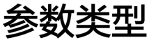

# vector\_dup

> **Section**: 6.3.11.1

## 功能说明

## 该接口用于复制数据：

对于 b16 类型：将

16 位数据一次最多复制 16*8 个元素，写入目的地址。

对于 b32 类型：将

32 位数据一次最多复制 8*8 个元素，写入目的地址。

该接口支持通过 MASK 控制哪些元素参与计算。

## // 相同接口的不同原型区别在于源地址和目的地址的数据类型不同

void vector\_dup(\_\_ubuf\_\_ bfloat16\_t *dst, bfloat16\_t src, uint8\_t repeat, uint16\_t dstBlockStride, uint16\_t srcBlockStride, uint16\_t dstRepeatStride, uint16\_t srcRepeatStride);

void vector\_dup(\_\_ubuf\_\_ float *dst, float src, uint8\_t repeat, uint16\_t dstBlockStride, uint16\_t srcBlockStride, uint16\_t dstRepeatStride, uint16\_t srcRepeatStride);

void vector\_dup(\_\_ubuf\_\_ int32\_t *dst, int32\_t src, uint8\_t repeat, uint16\_t dstBlockStride, uint16\_t srcBlockStride, uint16\_t dstRepeatStride, uint16\_t srcRepeatStride);

void vector\_dup(\_\_ubuf\_\_ uint16\_t *dst, uint16\_t src, uint8\_t repeat, uint16\_t dstBlockStride, uint16\_t srcBlockStride, uint16\_t dstRepeatStride, uint16\_t srcRepeatStride);

void vector\_dup(\_\_ubuf\_\_ uint32\_t *dst, uint32\_t src, uint8\_t repeat, uint16\_t dstBlockStride, uint16\_t srcBlockStride, uint16\_t dstRepeatStride, uint16\_t srcRepeatStride);

void vector\_dup(\_\_ubuf\_\_ int16\_t *dst, int16\_t src, uint8\_t repeat, uint16\_t dstBlockStride, uint16\_t srcBlockStride, uint16\_t dstRepeatStride, uint16\_t srcRepeatStride);

void vector\_dup(\_\_ubuf\_\_ half *dst, half src, uint8\_t repeat, uint16\_t dstBlockStride, uint16\_t srcBlockStride, uint16\_t dstRepeatStride, uint16\_t srcRepeatStride);

**[Image: figure_1520.png (214x58, 8.6KB)]**

## 流水类型

表 6-12 vector\_dup 参数说明

| 参数名             | 说明                                                                                            | 取值范围       | 单位   |
|-----------------|-----------------------------------------------------------------------------------------------|------------|------|
| dst             | 目的操作数起始地 址。                                                                                   | /          | /    |
| src             | 源操作数起始地 址。                                                                                    | /          | /    |
| repeat          | 接口迭代次数： b16 ： repeat = Num/(16*8) ； b32: repeat = Num/(8*8) 。                                 | [0, 2^8-1] | /    |
| dstBlockStride  | 同一次执行，目的 操作数不同 block 间 地址步长。例如， 当 dstBlockStride 为 3 ，每个 dst block 的起始地址间 隔为 2 个 block(64B) 。 | [0, 2^8-1] | 32B  |
| srcBlockStride  | 同一次执行，源操 作数不同 block 间地 址步长。                                                                   | [0, 2^8-1] | 32B  |
| dstRepeatStride | 相邻两次执行，目 的操作数相同 block 地址步长。 0 表示 两次迭代的所有对 应块指向相同的地 址。                                         | [0, 2^8-1] | 32B  |
| srcRepeatStride | 相邻两次执行，源 操作数相同 block 地 址步长。                                                                   | [0, 2^8-1] | 32B  |

参数表中的 Stride 均指代相邻两个首地址间的步长。

PIPE\_V
