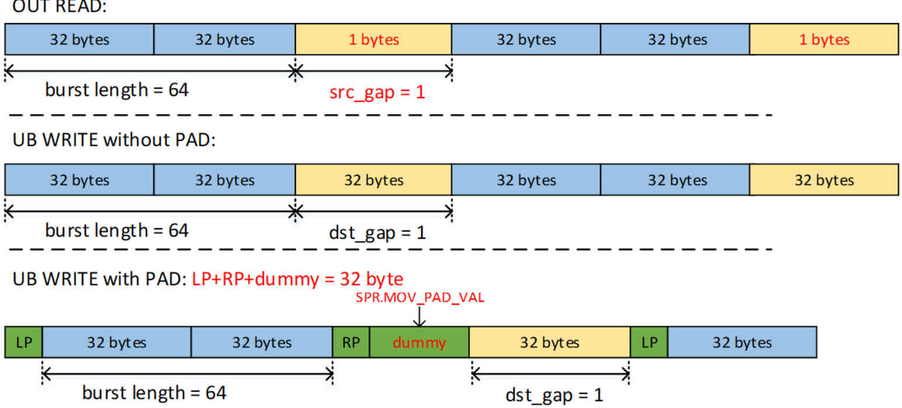
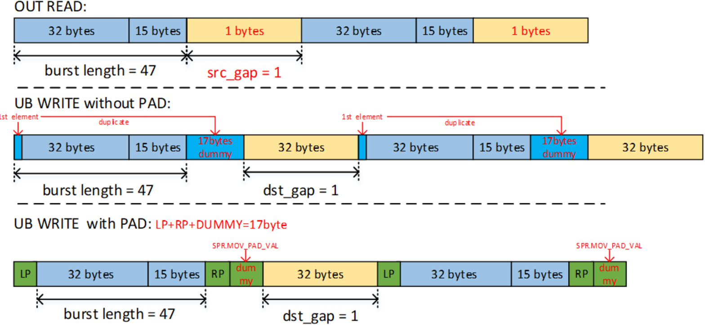

# copy\_gm\_to\_ubuf\_align

> **Section**: 6.5.9.2

## 功能说明

从 GM 搬运至 UB 的 align 接口。

如果 lenBurst+ leftPaddingNum+ rightPaddingNum 对齐为 32B ，则没有哑数据写入 UB ，从 OUT 读取的所有数据将写入 UB ，否则会有额外的哑数据写入 UB 。哑数据是在 不进行 padding 的情况下，每个 burst 的第一个元素的复制。如果做了 padding ，哑数据 就是 6.5.9.4 set\_mov\_pad\_val 中 padding 值的重复。

## 接口原型

## 流水类型

图 6-2 copy\_gm\_to\_ubuf\_align 图示，其中 lenBurst+ leftPaddingNum+ rightPaddingNum 对齐为 32B

OUT READ:

**[Image: figure_2024.png (1544x699, 193.4KB)]**

图 6-3 copy\_gm\_to\_ubuf\_align 图示，其中 lenBurst+ leftPaddingNum+ rightPaddingNum 未对齐为 32B

**[Image: figure_2026.png (1568x724, 222.0KB)]**

## // 相同接口的不同原型区别在于源地址和目的地址的数据类型不同

void copy\_gm\_to\_ubuf\_align\_b8(\_\_ubuf\_\_ void *dst, \_\_gm\_\_ void *src, uint8\_t sid, uint16\_t nBurst, uint32\_t lenBurst, uint8\_t leftPaddingNum, uint8\_t rightPaddingNum, uint32\_t srcGap, uint32\_t dstGap);

void copy\_gm\_to\_ubuf\_align\_b16(\_\_ubuf\_\_ void *dst, \_\_gm\_\_ void *src, uint8\_t sid, uint16\_t nBurst, uint32\_t lenBurst, uint8\_t leftPaddingNum, uint8\_t rightPaddingNum, uint32\_t srcGap, uint32\_t dstGap);

void copy\_gm\_to\_ubuf\_align\_b32(\_\_ubuf\_\_ void *dst, \_\_gm\_\_ void *src, uint8\_t sid, uint16\_t nBurst, uint32\_t lenBurst, uint8\_t leftPaddingNum, uint8\_t rightPaddingNum, uint32\_t srcGap, uint32\_t dstGap);

PIPE\_MTE2
