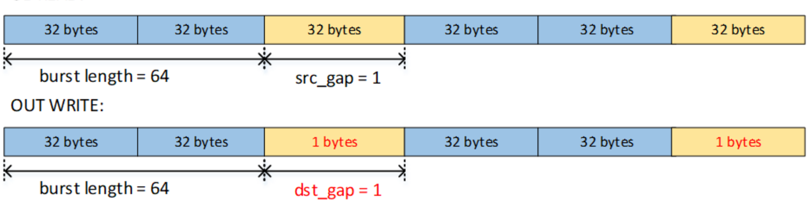
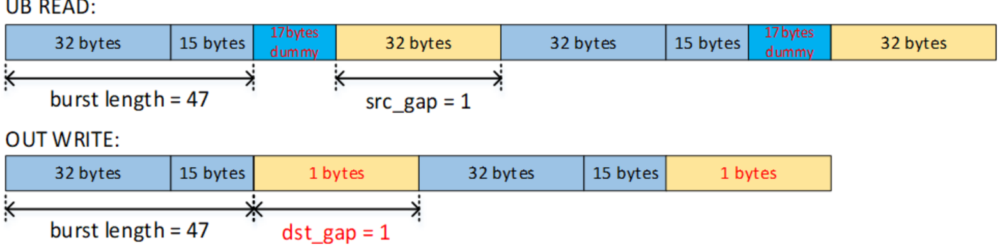

# copy\_ubuf\_to\_gm\_align

> **Section**: 6.5.9.3

## 功能说明

## 接口原型

## 流水类型

从 UB 搬运至 GM 的 align 接口。

执行此接口时，硬件从 UB 读取的每个 burst 的实际数据大小为：

((burst\_length - 1)/32 + 1)*32 (bytes).

如果 burst\_length 与 32B 对齐，则不会从 UB 读取哑数据，从 UB 读取的所有数据将写入 GM ，如下图所示。

图 6-4 copy\_ubuf\_to\_gm\_align 图示，其中 burst length 是 32B 对齐的

UBREAD:

**[Image: figure_2042.png (1565x391, 105.4KB)]**

如果 burst\_length 未对齐到 32B ，则将从 UB 读取哑数据，并在写入 GM 时丢弃，如下所 示。

图 6-5 copy\_ubuf\_to\_gm\_align 图示，其中 burst length 不是 32B 对齐的

UBREAD:

**[Image: figure_2046.png (1563x387, 117.3KB)]**

## // 相同接口的不同原型区别在于源地址和目的地址的数据类型不同

void copy\_ubuf\_to\_gm\_align\_b8(\_\_gm\_\_ void *dst, \_\_ubuf\_\_ void *src, uint8\_t sid, uint16\_t nBurst, uint32\_t lenBurst, uint8\_t leftPaddingNum, uint8\_t rightPaddingNum, uint32\_t srcGap, uint32\_t dstGap);

void copy\_ubuf\_to\_gm\_align\_b32(\_\_gm\_\_ void *dst, \_\_ubuf\_\_ void *src, uint8\_t sid, uint16\_t nBurst, uint32\_t lenBurst, uint8\_t leftPaddingNum, uint8\_t rightPaddingNum, uint32\_t srcGap, uint32\_t dstGap);

void copy\_ubuf\_to\_gm\_align\_b16(\_\_gm\_\_ void *dst, \_\_ubuf\_\_ void *src, uint8\_t sid, uint16\_t nBurst, uint32\_t lenBurst, uint8\_t leftPaddingNum, uint8\_t rightPaddingNum, uint8\_t srcGap, uint8\_t dstGap);

PIPE\_MTE3
