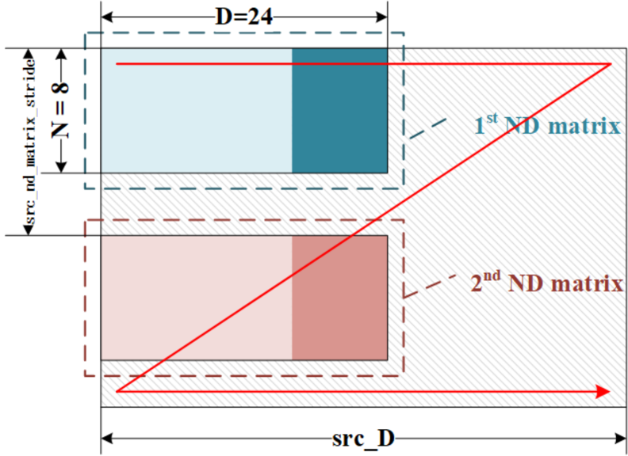
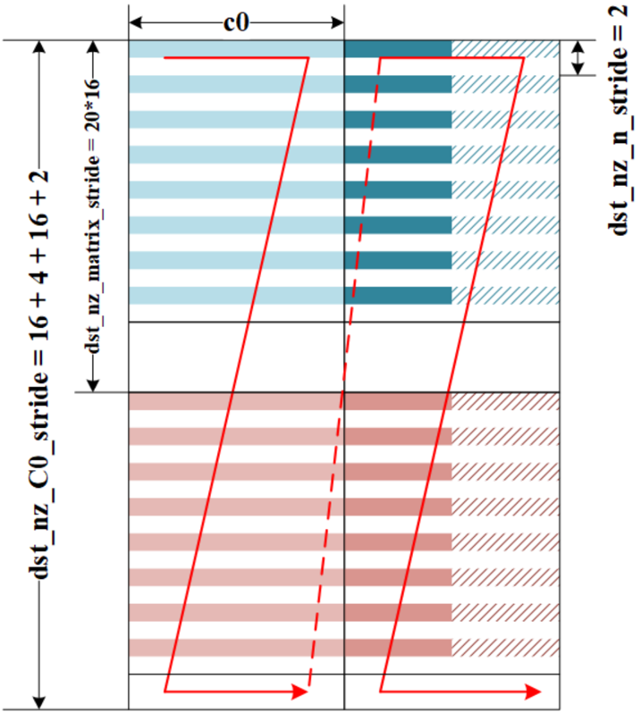

# copy\_gm\_to\_cbuf\_multi\_nd2nz

> **Section**: 6.5.10.1


## 功能说明

## 接口原型

从 GM 到 L1 数据加载期间的数据格式转换接口，支持 ND-&gt;NZ 、 NHWC-&gt;NC1HWC0 和 NHWC-&gt;C1HWNC0 的格式转换。支持类型 ={b8, b16, b32s } 。当类型 ={b8, b16, b32s} ， c0\_size is 32Bytes 。如果搬运数据的最低维度未对齐到 32 字节（针对 c0\_size 为 32 的情况），则会对其在 L1 中填充零值到 32B 。

存储在 GM 中的数据为 ND 格式（行主序存储），存储在 L1 中的数据为 NZ 格式（即大 N 小 Z ，块间按列优先顺序存储、块内按行优先存储）。该接口能够处理多个 ND 到 NZ 的 转换。

## 每个元素的搬移运算可有以下循环计算：

```
for(i=0;i<nd_num;i++) {  // every loop: n*d*32 src_nd_addr = Xn + SRC_nd_matrix_stride * i * sizeof(data_type); dst_nd_addr = Xd + DST_nz_matrix_stride * i * sizeof(data_type); for(j=0;j<n;j++) {   // every loop d*32 src_n_addr = src_nd_addr + j * SRC_D * sizeof(data_type); dst_n_addr = dst_nd_addr + j * DST_nz_n_stride * C0_Size; for(k=0;k<ceil(d * sizeof(data_type)) / 32;k++) {  // every loop: 32Byte src_block_addr = src_n_addr + k * 32; dst_block_addr = dst_n_addr + k * DST_nz_C0_stride * C0_Size; } } }
```

// 相同接口的不同原型区别在于源地址和目的地址的数据类型不同 void copy\_gm\_to\_cbuf\_multi\_nd2nz\_b16(\_\_cbuf\_\_ bfloat16\_t *dst, \_\_gm\_\_ bfloat16\_t *src, uint8\_t sid, uint16\_t ndNum, uint16\_t nValue, uint16\_t dValue, uint16\_t srcNdMatrixStride, uint16\_t srcDValue, uint16\_t dstNzC0Stride, uint16\_t dstNzNStride, uint16\_t dstNzMatrixStride); void copy\_gm\_to\_cbuf\_multi\_nd2nz\_b16(\_\_cbuf\_\_ half *dst, \_\_gm\_\_ half *src, uint8\_t sid, uint16\_t ndNum, uint16\_t nValue, uint16\_t dValue, uint16\_t srcNdMatrixStride, uint16\_t srcDValue, uint16\_t dstNzC0Stride, uint16\_t dstNzNStride, uint16\_t dstNzMatrixStride); void copy\_gm\_to\_cbuf\_multi\_nd2nz\_b16(\_\_cbuf\_\_ int16\_t *dst, \_\_gm\_\_ int16\_t *src, uint8\_t sid, uint16\_t ndNum, uint16\_t nValue, uint16\_t dValue, uint16\_t srcNdMatrixStride, uint16\_t srcDValue, uint16\_t dstNzC0Stride, uint16\_t dstNzNStride, uint16\_t dstNzMatrixStride); void copy\_gm\_to\_cbuf\_multi\_nd2nz\_b16(\_\_cbuf\_\_ uint16\_t *dst, \_\_gm\_\_ uint16\_t *src, uint8\_t sid, uint16\_t ndNum, uint16\_t nValue, uint16\_t dValue, uint16\_t srcNdMatrixStride, uint16\_t srcDValue, uint16\_t

## 参数说明

dstNzC0Stride, uint16\_t dstNzNStride, uint16\_t dstNzMatrixStride);

void copy\_gm\_to\_cbuf\_multi\_nd2nz\_b32s(\_\_cbuf\_\_ float *dst, \_\_gm\_\_ float *src, uint8\_t sid, uint16\_t ndNum, uint16\_t nValue, uint16\_t dValue, uint16\_t srcNdMatrixStride, uint16\_t srcDValue, uint16\_t dstNzC0Stride, uint16\_t dstNzNStride, uint16\_t dstNzMatrixStride);

void copy\_gm\_to\_cbuf\_multi\_nd2nz\_b32s(\_\_cbuf\_\_ int32\_t *dst, \_\_gm\_\_ int32\_t *src, uint8\_t sid, uint16\_t ndNum, uint16\_t nValue, uint16\_t dValue, uint16\_t srcNdMatrixStride, uint16\_t srcDValue, uint16\_t dstNzC0Stride, uint16\_t dstNzNStride, uint16\_t dstNzMatrixStride);

void copy\_gm\_to\_cbuf\_multi\_nd2nz\_b32s(\_\_cbuf\_\_ uint32\_t *dst, \_\_gm\_\_ uint32\_t *src, uint8\_t sid, uint16\_t ndNum, uint16\_t nValue, uint16\_t dValue, uint16\_t srcNdMatrixStride, uint16\_t srcDValue, uint16\_t dstNzC0Stride, uint16\_t dstNzNStride, uint16\_t dstNzMatrixStride);

void copy\_gm\_to\_cbuf\_multi\_nd2nz\_b8(\_\_cbuf\_\_ int8\_t *dst, \_\_gm\_\_ int8\_t *src, uint8\_t sid, uint16\_t ndNum, uint16\_t nValue, uint16\_t dValue, uint16\_t srcNdMatrixStride, uint16\_t srcDValue, uint16\_t dstNzC0Stride, uint16\_t dstNzNStride, uint16\_t dstNzMatrixStride);

void copy\_gm\_to\_cbuf\_multi\_nd2nz\_b8(\_\_cbuf\_\_ uint8\_t *dst, \_\_gm\_\_ uint8\_t *src, uint8\_t sid, uint16\_t ndNum, uint16\_t nValue, uint16\_t dValue, uint16\_t srcNdMatrixStride, uint16\_t srcDValue, uint16\_t dstNzC0Stride, uint16\_t dstNzNStride, uint16\_t dstNzMatrixStride);

表 6-28 copy\_gm\_to\_cbuf\_multi\_nd2nz 参数说明

| 参数名                | 说明                                                                                                        | 取值范围         | 单位   |
|--------------------|-----------------------------------------------------------------------------------------------------------|--------------|------|
| dst                | 目的地址，其是 32B 对齐的，目 的数据是 (d//c0)nc0 形式，并且 c0 是 32B 。                                                        | /            | /    |
| src                | 源数据地址，其是按单字节对 齐的， src 中的数据为二维连续 数据。                                                                       | /            | /    |
| sid                | 用于 SMMU TLB 预取提示，一 般为 0 。                                                                                 | /            | /    |
| ndNum              | 待搬运数据的 nd 块数量，图 1 参数含义示意图中的 ndNum 为 2 。                                                                   | [0 ,2^12-1 ] | elem |
| nValue             | 数据块 n 方向长度，含义见图 1 参数含义示意图中的 N 。                                                                           | [0, 16384]   | elem |
| dValue             | 数据块 d 方向长度，含义见图 1 参数含义示意图中的 D 。                                                                           | [0, 65535]   | elem |
| srcNdMatri xStride | 源数据块 nd 块之间的距离，含 义见下图中的 Src_nd_matrix_stride ，第二个 nd 矩阵起始地址为： src +srcNdMatrixStride*sizeof(dat a_type) 。 | [0, 65535]   | elem |
| srcDValue          | SRC_D 值，用于指示源 nd 矩阵 的 d 维大小，含义见图 1 参数含 义示意图中的 src_D 。                                                     | [1, 65535]   | elem |

## 流水类型

| 参数名                | 说明                                                                                                                                        | 取值范围       | 单位      |
|--------------------|-------------------------------------------------------------------------------------------------------------------------------------------|------------|---------|
| dstNzC0Stri de     | L1 中 nz 上 2 个 c0 块之间的距离， 见图 1 参数含义示意图中的 DST_nz_C0_stride 。                                                                                | [1, 16384] | C0_size |
| dstNzNStri de      | L1 中 n 维上 2 个 c0 块之间的距 离，见图 1 参数含义示意图中的 DST_nz_n_stride 。                                                                                 | [1, 16384] | C0_size |
| dstNzMatri xStride | 2 个 nd 矩阵中 2 个 NZ 矩阵的距 离，见图 1 参数含义示意图中的 DST_nz_matrix_stride 。第 2 个 nd 矩阵的第 1 个 NZ 分形的地址 是 Xd + DST_nz_matrix_stride*sizeof(d ata_type) 。 | [1, 65535] | elem    |

## 图 6-6 参数含义示意图



**[Image: figure_2080.png (792x576, 137.5KB)]**

## 注意：

- 当 type={b8,b16,b32S} ， C0\_size 为 32 字节时，目标数据不得存在重叠。如果存在 重叠，写入 L1 时硬件不会报告任何警告或错误，并且无法保证重叠数据的写入顺 序。
- ndNum=0 或 nValue=0 或 dValue=0 表示不执行，此接口将被视为 NOP （无操作接 口），并会报告警告。
- copy\_gm\_to\_cbuf\_multi\_nd2nz 中的 stride 均指代上一个首地址到下一个首地址的 距离。

PIPE\_MTE2



**[Image: figure_2086.png (717x798, 152.1KB)]**
