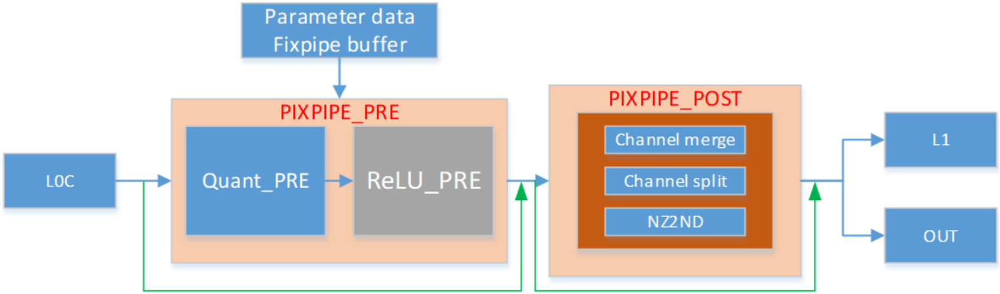

# 接口基本信息

> **Section**: 6.5.12.1


Fixpipe 是一种执行从 L0C 到 GM 或 L1 数据移动的管道，在数据搬运时，其可以执行下述 操作：预量化、预 ReLU 、 int8 通道合并、 int4 通道合并、 f32 通道切分、 NZ2ND 转 换。处理过程见下图：

## 图 6-7 处理过程



**[Image: figure_2104.png (1574x463, 75.8KB)]**

当通道合并、通道切分、 NZ2ND 被禁用时，接口被定义为从 L0C 到 L1/OUT 的常规数据 搬运。 当 m （矩阵为 m*n ）不是 16 的倍数时，硬件将读取额外的哑数据（哑数据指多 读的数据，后续会被丢弃），并在写入目标时丢弃这些哑数据。在给定 m 和 n 方向大小 的情况下，数据块定义为连续 ceil(m/16) 个 16*16 分形块，数据块长度定义为 m*16*sizeof(data\_type) 。源地址和目的地址的计算代码如下：

```
for(j = 0;j < m;j++) { src_temp_n_addr = Xn + j * sizeof(L0C_element) * 16; dst_temp_n_addr = Xd + j * 16 * sizeof(DST_element); for(k = 0; k < ceil(n/16); k++) { src_block_addr = src_temp_n_addr + k * src_stride * sizeof(L0C_element) * 16; dst_block_addr = dst_temp_n_addr + k * dst_stride * 32; } }
```

若转换为 s8 或 u8 的目标数据类型，分形矩阵需要通过硬件从 16*16 转换为 16*32 。如果 通道 n 是 16 的偶数倍，则 n 方向上每 2 个相邻的 16*16 分形矩阵将合并为 1 个 16*32 分形矩 阵。如果 n 是 16 的奇数倍，则将通道 1 到通道（ n-16 ）合并，最后 16 个通道保持未合 并。 例如，目标数据类型为 s8 ， m 为 32 ， n 为 48 ，它将首先将第 2 个 16*16 分形矩阵合 并为一个 16*32 矩阵，然后将剩余的 16*16 分形矩阵直接移入 L1 。

对于转换为 s4 或 u4 的目标数据类型，分形矩阵也通过硬件从 16*16 转换为 16*64 ，如果 输出通道数 n （矩阵为 m*n ）是 64 的倍数，则 n 方向上每 4 个相邻的 16*16 分形矩阵将合 并为 1 个 16*64 分形矩阵。 例如，目标数据类型是 s4 ， m 是 32 ， n 是 64 ，它将首先将第 1 个 16*16 分形矩阵合并为一个 16*64 矩阵，然后将第 2 个 16*16 分形矩阵也合并。 在这种 情况下， n 的配置必须是 64 的倍数。

对于目标类型为 f32 ，分形矩阵可以通过硬件从 16*16 转换为 16*8 ，如果启用通道切分 （ channelSplit=1 ），则每个 16*16 分形矩阵将被分裂为 2 个 16*8 分形矩阵。 例如，目

## 常规搬运

## int8 通道合并

## int4 通道合并

## f32 通道切分

## NZ2ND 转换

标数据类型是 F32 ， m 是 64 ， n 是 32 ，它将被拆分为 16 个 16*8 的分形。 如果启用通道 切分， n 可以是 8 的倍数。例如，如果 n=24 ，则上面的示例将仅向 OUT 输出 3 列 16*8 分 形。

当 NZ2ND\_EN 使能时，此接口定义为从 L0C 到目的地址的带 NZ2ND 转换的数据搬运。

```
转换流程如下： for(i = 0; i < nd_num; i++) { src_temp_nd_addr = Xn + src_nd_stride * i * fractal_size; dst_temp_nd_addr = Xd + src_nd_stride * i * sizeof(DST_element); for(j = 0; j < m; j++) { src_temp_n_addr = src_temp_nd_addr + j * sizeof(L0C_element) * 16; dst_temp_n_addr = dst_temp_nd_addr + j * dst_D * sizeof(DST_element); for(k = 0; k < ceil(n/16); k++) { src_block_addr = src_temp_n_addr + k * src_stride * sizeof(L0C_element) * 16; dst_block_addr = dst_temp_n_addr + k * 16 * sizeof(DST_element); } } }
```
