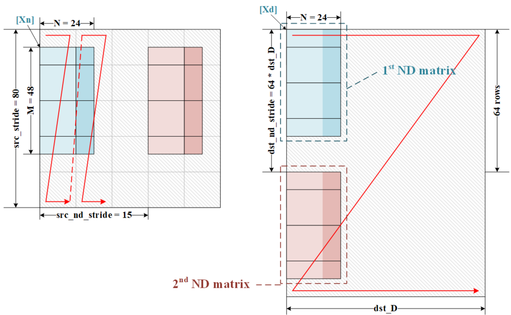

# copy\_matrix\_cc\_to\_cbuf/copy\_matrix\_cc\_to\_gm

> **Section**: 6.5.12.2

## 功能说明

## 接口原型

把 CUBE 运算结果 C 矩阵从 L0C 搬运至 L1 或 GM 。

// 相同接口的不同原型区别在于源地址和目的地址的数据类型不同 // copy\_matrix\_cc\_to\_cbuf void copy\_matrix\_cc\_to\_cbuf(\_\_cbuf\_\_ half *dst, \_\_cc\_\_ float *src, uint8\_t sid, uint16\_t NSize, uint16\_t MSize, uint32\_t dstStride\_dst\_D, uint16\_t srcStride, uint8\_t UnitFlagMode, uint64\_t QuantPRE, uint8\_t ReLUPRE, bool channelSplit, bool NZ2ND\_EN); void copy\_matrix\_cc\_to\_cbuf(\_\_cbuf\_\_ bfloat16\_t *dst, \_\_cc\_\_ float *src, uint8\_t sid, uint16\_t NSize, uint16\_t MSize, uint32\_t dstStride\_dst\_D, uint16\_t srcStride, uint8\_t UnitFlagMode, uint64\_t QuantPRE, uint8\_t ReLUPRE, bool channelSplit, bool NZ2ND\_EN); void copy\_matrix\_cc\_to\_cbuf(\_\_cbuf\_\_ int8\_t *dst, \_\_cc\_\_ float *src, uint8\_t sid, uint16\_t NSize, uint16\_t MSize, uint32\_t dstStride\_dst\_D, uint16\_t srcStride, uint8\_t UnitFlagMode, uint64\_t QuantPRE, uint8\_t ReLUPRE, bool channelSplit, bool NZ2ND\_EN); void copy\_matrix\_cc\_to\_cbuf(\_\_cbuf\_\_ uint8\_t *dst, \_\_cc\_\_ float *src, uint8\_t sid, uint16\_t NSize, uint16\_t MSize, uint32\_t dstStride\_dst\_D, uint16\_t srcStride, uint8\_t UnitFlagMode, uint64\_t QuantPRE, uint8\_t ReLUPRE, bool channelSplit, bool NZ2ND\_EN); void copy\_matrix\_cc\_to\_cbuf(\_\_cbuf\_\_ half *dst, \_\_cc\_\_ int32\_t *src, uint8\_t sid, uint16\_t NSize, uint16\_t MSize, uint32\_t dstStride\_dst\_D, uint16\_t srcStride, uint8\_t UnitFlagMode, uint64\_t QuantPRE, uint8\_t ReLUPRE, bool channelSplit, bool NZ2ND\_EN); void copy\_matrix\_cc\_to\_cbuf(\_\_cbuf\_\_ int16\_t *dst, \_\_cc\_\_ int32\_t *src, uint8\_t sid, uint16\_t NSize, uint16\_t MSize, uint32\_t dstStride\_dst\_D, uint16\_t srcStride, uint8\_t UnitFlagMode, uint64\_t QuantPRE, uint8\_t ReLUPRE, bool channelSplit, bool NZ2ND\_EN); void copy\_matrix\_cc\_to\_cbuf(\_\_cbuf\_\_ int8\_t *dst, \_\_cc\_\_ int32\_t *src, uint8\_t sid, uint16\_t NSize, uint16\_t MSize, uint32\_t dstStride\_dst\_D, uint16\_t srcStride, uint8\_t UnitFlagMode, uint64\_t QuantPRE, uint8\_t ReLUPRE, bool channelSplit, bool NZ2ND\_EN); void copy\_matrix\_cc\_to\_cbuf(\_\_cbuf\_\_ uint8\_t *dst, \_\_cc\_\_ int32\_t *src, uint8\_t sid, uint16\_t NSize, uint16\_t MSize, uint32\_t dstStride\_dst\_D, uint16\_t srcStride, uint8\_t UnitFlagMode, uint64\_t QuantPRE, uint8\_t ReLUPRE, bool channelSplit, bool NZ2ND\_EN);

## // void *dst 为 b4

void copy\_matrix\_cc\_to\_cbuf\_b4(\_\_cbuf\_\_ void *dst, \_\_cc\_\_ float *src, uint8\_t sid, uint16\_t NSize, uint16\_t MSize, uint32\_t dstStride\_dst\_D, uint16\_t srcStride, uint8\_t UnitFlagMode, uint64\_t QuantPRE, uint8\_t ReLUPRE, bool channelSplit, bool NZ2ND\_EN);

void copy\_matrix\_cc\_to\_cbuf\_b4(\_\_cbuf\_\_ void *dst, \_\_cc\_\_ int32\_t *src, uint8\_t sid, uint16\_t NSize, uint16\_t MSize, uint32\_t dstStride\_dst\_D, uint16\_t srcStride, uint8\_t UnitFlagMode, uint64\_t QuantPRE, uint8\_t ReLUPRE, bool channelSplit, bool NZ2ND\_EN);

## // copy\_matrix\_cc\_to\_gm

void copy\_matrix\_cc\_to\_gm(\_\_gm\_\_ half *dst, \_\_cc\_\_ float *src, uint8\_t sid, uint16\_t NSize, uint16\_t MSize, uint32\_t dstStride\_dst\_D, uint16\_t srcStride, uint8\_t UnitFlagMode, uint64\_t QuantPRE, uint8\_t ReLUPRE, bool channelSplit, bool NZ2ND\_EN);

void copy\_matrix\_cc\_to\_gm(\_\_gm\_\_ bfloat16\_t *dst, \_\_cc\_\_ float *src, uint8\_t sid, uint16\_t NSize, uint16\_t MSize, uint32\_t dstStride\_dst\_D, uint16\_t srcStride, uint8\_t UnitFlagMode, uint64\_t QuantPRE, uint8\_t ReLUPRE, bool channelSplit, bool NZ2ND\_EN);

void copy\_matrix\_cc\_to\_gm(\_\_gm\_\_ int8\_t *dst, \_\_cc\_\_ float *src, uint8\_t sid, uint16\_t NSize, uint16\_t MSize, uint32\_t dstStride\_dst\_D, uint16\_t srcStride, uint8\_t UnitFlagMode, uint64\_t QuantPRE, uint8\_t ReLUPRE, bool channelSplit, bool NZ2ND\_EN);

void copy\_matrix\_cc\_to\_gm(\_\_gm\_\_ uint8\_t *dst, \_\_cc\_\_ float *src, uint8\_t sid, uint16\_t NSize, uint16\_t MSize, uint32\_t dstStride\_dst\_D, uint16\_t srcStride, uint8\_t UnitFlagMode, uint64\_t QuantPRE, uint8\_t ReLUPRE, bool channelSplit, bool NZ2ND\_EN);

void copy\_matrix\_cc\_to\_gm(\_\_gm\_\_ float *dst, \_\_cc\_\_ float *src, uint8\_t sid, uint16\_t NSize, uint16\_t MSize, uint32\_t dstStride\_dst\_D, uint16\_t srcStride, uint8\_t UnitFlagMode, uint64\_t QuantPRE, uint8\_t ReLUPRE, bool channelSplit, bool NZ2ND\_EN);

void copy\_matrix\_cc\_to\_gm(\_\_gm\_\_ half *dst, \_\_cc\_\_ int32\_t *src, uint8\_t sid, uint16\_t NSize, uint16\_t MSize, uint32\_t dstStride\_dst\_D, uint16\_t srcStride, uint8\_t UnitFlagMode, uint64\_t QuantPRE, uint8\_t ReLUPRE, bool channelSplit, bool NZ2ND\_EN);

void copy\_matrix\_cc\_to\_gm(\_\_gm\_\_ int16\_t *dst, \_\_cc\_\_ int32\_t *src, uint8\_t sid, uint16\_t NSize, uint16\_t MSize, uint32\_t dstStride\_dst\_D, uint16\_t srcStride, uint8\_t UnitFlagMode, uint64\_t QuantPRE, uint8\_t ReLUPRE, bool channelSplit, bool NZ2ND\_EN);

void copy\_matrix\_cc\_to\_gm(\_\_gm\_\_ int8\_t *dst, \_\_cc\_\_ int32\_t *src, uint8\_t sid, uint16\_t NSize, uint16\_t MSize, uint32\_t dstStride\_dst\_D, uint16\_t srcStride, uint8\_t UnitFlagMode, uint64\_t QuantPRE, uint8\_t ReLUPRE, bool channelSplit, bool NZ2ND\_EN);

void copy\_matrix\_cc\_to\_gm(\_\_gm\_\_ uint8\_t *dst, \_\_cc\_\_ int32\_t *src, uint8\_t sid, uint16\_t NSize, uint16\_t MSize, uint32\_t dstStride\_dst\_D, uint16\_t srcStride, uint8\_t UnitFlagMode, uint64\_t QuantPRE, uint8\_t ReLUPRE, bool channelSplit, bool NZ2ND\_EN);

void copy\_matrix\_cc\_to\_gm(\_\_gm\_\_ int32\_t *dst, \_\_cc\_\_ int32\_t *src, uint8\_t sid, uint16\_t NSize, uint16\_t MSize, uint32\_t dstStride\_dst\_D, uint16\_t srcStride, uint8\_t UnitFlagMode, uint64\_t QuantPRE, uint8\_t ReLUPRE, bool channelSplit, bool NZ2ND\_EN);

## // void *dst 为 b4

void copy\_matrix\_cc\_to\_gm\_b4(\_\_gm\_\_ void *dst, \_\_cc\_\_ float *src, uint8\_t sid, uint16\_t NSize, uint16\_t MSize, uint32\_t dstStride\_dst\_D, uint16\_t srcStride, uint8\_t UnitFlagMode, uint64\_t QuantPRE, uint8\_t ReLUPRE, bool channelSplit, bool NZ2ND\_EN);

void copy\_matrix\_cc\_to\_gm\_b4(\_\_gm\_\_ void *dst, \_\_cc\_\_ int32\_t *src, uint8\_t sid, uint16\_t NSize, uint16\_t MSize, uint32\_t dstStride\_dst\_D, uint16\_t srcStride, uint8\_t UnitFlagMode, uint64\_t QuantPRE, uint8\_t ReLUPRE, bool channelSplit, bool NZ2ND\_EN);

## 参数说明

## 表 6-30 L0C 搬至 L1 参数说明

| 参数名              | 说明                                                                                                               | 取值范围        | 单 位         |
|------------------|------------------------------------------------------------------------------------------------------------------|-------------|-------------|
| dst              | 目的地址， L1/GM 。 若目标地址是 L1 ，则是 32 字节对齐的；若目标地 址是 GM ，则是单字节对齐的。                                                       | /           | /           |
| src              | 源地址，源地址数据类型为 {f32, s32} 。对于 type={f32, s32} ，其是 64 字节对齐的。                                                        | /           | /           |
| sid              | 预留参数，设置为 0 即可。                                                                                                   | /           | /           |
| NSize            | L0C 源矩阵在 n 方向的大小。 如果启用了 fp32 通道拆分，它是 8 的倍数。 如果启用了 int4 通道合并，它是 64 的倍数。 如果 NZ2ND_EN 使能，则范围为 [1,8192] 。            | [0, 2^12-1] | ele m       |
| MSize            | L0C 源矩阵在 m 方向的大小。当 m 不是 16 的倍数 时，硬件会读取额外的填充数据，并在写入目标 时丢弃这些填充数据。                                                  | [0, 2^16-1] | ele m       |
| dstStride_dst_ D | 如果 NZ2ND_EN 不使能，则它是不同数据块的 dst stride （首地址到首地址），单位为 32B 。 如果 NZ2ND_EN 使能，它是以元素为单位的 dst_D 值， dst_D 含义见图 1 参数含义示意图。 | [1, 2^32-1] | 32B / ele m |
| srcStride        | L0C 源矩阵中不同数据块间距离，必须为 16 的倍 数， srcStride 含义见图 1 参数含义示意图中的 src_stride 。                                            | [0, 2^16-1] | C0_ size    |
| UnitFlagMod e    | 预留参数，设置为 0 即可                                                                                                    | /           | /           |
| QuantPRE         | 预量化模式，预留参数，设为 5'b00000 即可，代 表不做量化。                                                                               | /           | /           |
| ReLUPRE          | ReLU 模式 ● 3 ' b000: no ReLU ； ● 3 ' b001: normal ReLU ； ● 3 ' b010: leaky ReLU ； ● 3 ' b011: pReLU 。             | /           | /           |
| channelSplit     | 是否使能通道切分。                                                                                                        | [0, 1]      | /           |
| NZ2ND_EN         | 是否使能 NZ2ND_EN 格式转换。                                                                                              | [0, 1]      | /           |

ReLUPRE 使用 leaky ReLU 模式后，需要通过以下接口设置相关参数：

## 流水类型

void set\_lrelu\_alpha(float config);

config[31:0] ： ReLU\_PRE 阶段 Leaky ReLU 中的 alpha 。

## NZ2ND\_EN 使能后，需要通过以下接口设置相关参数：

void set\_nd\_para(uint64\_t config);

- config[0:15] 位表示 nd 块数量；
- config[16:31] 位表示源数据 nd 块步长，其含义见图 1 参数含义示意图中的 src\_nd\_stride ，其单位为分形大小，取值范围为 [1,512] ，对于 type={f32, s32} ， 分形大小是 1024B;
- config[32:47] 位表示目的数据 nd 块步长，其含义见图 1 参数含义示意图中的 dst\_nd\_stride ，其单位为元素。

## 图 6-8 参数含义示意图

Source NZ matrix in LOC:

**[Image: figure_2154.png (1562x964, 501.6KB)]**

## 注意：

目标数据不能有重叠。如果对 L1 或 OUT 有重叠写入，硬件不会报告任何警告和错误， 也不保证重叠数据的写入顺序。

NSize=0 或 MSize=0 或 nd 块数量为 0 表示不执行，该接口将被视为 NOP 并报告警告。

PIPE\_FIX
