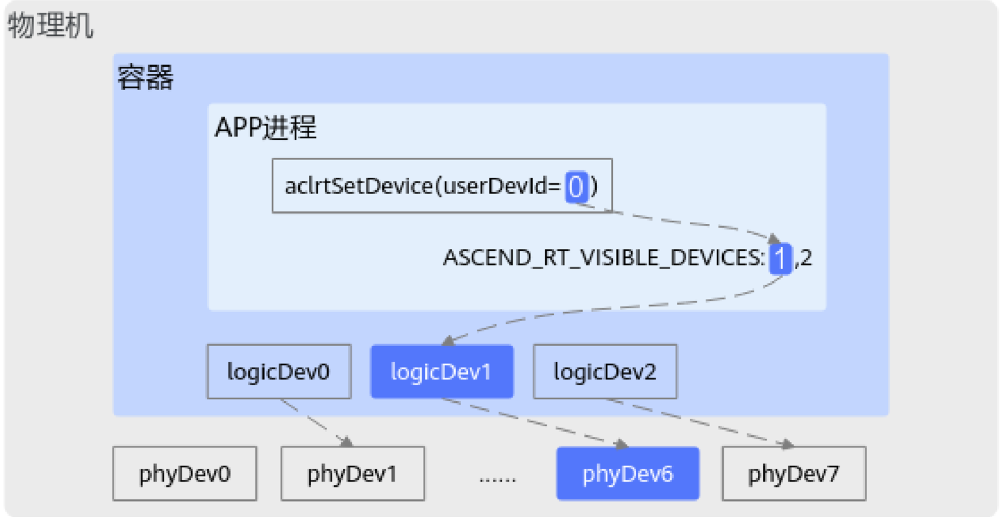

# aclrtGetPhyDevIdByLogicDevId

> **Section**: 1.6.29

## 产品支持情况

## 功能说明

## 函数原型

## 参数说明

## 返回值说明

| 产品                               | 是否支持   |
|----------------------------------|--------|
| Atlas 350 加速卡                    | √      |
| Atlas A3 训练系列产品 /Atlas A3 推理系列产品 | √      |
| Atlas A2 训练系列产品 /Atlas A2 推理系列产品 | √      |
| Atlas 200I/500 A2 推理产品           | √      |
| Atlas 推理系列产品                     | √      |
| Atlas 训练系列产品                     | √      |

根据逻辑设备 ID 获取对应的物理设备 ID 。

aclError aclrtGetPhyDevIdByLogicDevId(const int32\_t logicDevId, int32\_t *const phyDevId)

| 参数名        | 输入 / 输 出   | 说明        |
|------------|------------|-----------|
| logicDevId | 输入         | 逻辑设备 ID 。 |
| phyDevId   | 输出         | 物理设备 ID 。 |

返回 0 表示成功，返回其他值表示失败，请参见 1.28.1 aclError 。

## 用户设备 ID 、逻辑设备 ID 、物理设备 ID 之间的关系

若未设置 ASCEND\_RT\_VISIBLE\_DEVICES 环境变量，逻辑设备 ID 与用户设备 ID 相同；若 在非容器场景下，物理设备 ID 与逻辑设备 ID 相同。

下图以容器场景且设置 ASCEND\_RT\_VISIBLE\_DEVICES 环境变量为例说明三者之间的关 系：通过 ASCEND\_RT\_VISIBLE\_DEVICES 环境变量设置的 Device ID 依次为 1 、 2 ，对应 的 Device 索引值依次为 0 、 1 ，通过 aclrtSetDevice 接口设置的用户设备 ID 为 0 ，即对应 的 Device 索引值为 0 ，因此用户设备 ID= 0 对应逻辑设备 ID= 1 ，容器中的逻辑设备 ID= 1 又映射到物理设备 ID= 6 ，因此最终是使用 ID 为 6 的物理设备进行计算。

**[Image: figure_0955.png (1586x820, 133.8KB)]**

关于 ASCEND\_RT\_VISIBLE\_DEVICES 环境的详细介绍请参见《环境变量参考》。
