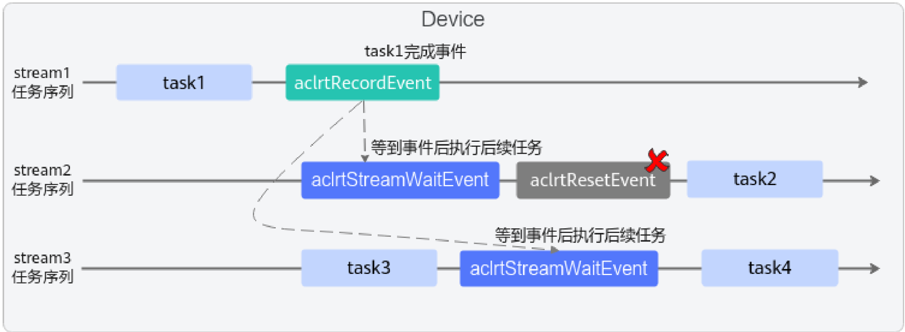

# aclrtResetEvent

> **Section**: 1.9.6

## 产品支持情况

| 产品                               | 是否支持   |
|----------------------------------|--------|
| Atlas 350 加速卡                    | √      |
| Atlas A3 训练系列产品 /Atlas A3 推理系列产品 | √      |
| Atlas A2 训练系列产品 /Atlas A2 推理系列产品 | √      |
| Atlas 200I/500 A2 推理产品           | √      |
| Atlas 推理系列产品                     | √      |
| Atlas 训练系列产品                     | √      |

复位 Event ，恢复 Event 初始状态，便于 Event 对象重复使用。异步接口。

对于多个 Stream 间任务同步的场景，通常在调用 aclrtStreamWaitEvent 接口之后再 复位 Event 。

aclError aclrtResetEvent(aclrtEvent event, aclrtStream stream)

## 参数说明

## 返回值说明

## 约束说明

| 参数名    | 输入 / 输 出   | 说明                                                                                                    |
|--------|------------|-------------------------------------------------------------------------------------------------------|
| event  | 输入         | 待复位的 Event 。类型定义请参见 aclrtEvent 。                                                                      |
| stream | 输入         | 指定 Stream 。类型定义请参见 aclrtStream 。 多个 Stream 间任务同步的场景，例如， Stream2 中的任务依 赖 Stream1 中的任务时，此处配置为 Stream2 。 |

返回 0 表示成功，返回其他值表示失败，请参见 1.28.1 aclError 。

仅支持复位由 aclrtCreateEventWithFlag 接口创建的、带有 ACL\_EVENT\_SYNC 标志的 Event 。

注意，在多个 Stream 中的任务需要等待同一个 Event 的情况下，不建议调用此接口来复 位 Event 。如图所示，如果在 stream2 中的 aclrtStreamWaitEvent 接口之后调用 aclrtResetEvent 接口， Event 将被复位，这会导致 stream3 中的 aclrtStreamWaitEvent 接口无法成功。

**[Image: figure_1527.png (1586x583, 138.8KB)]**
