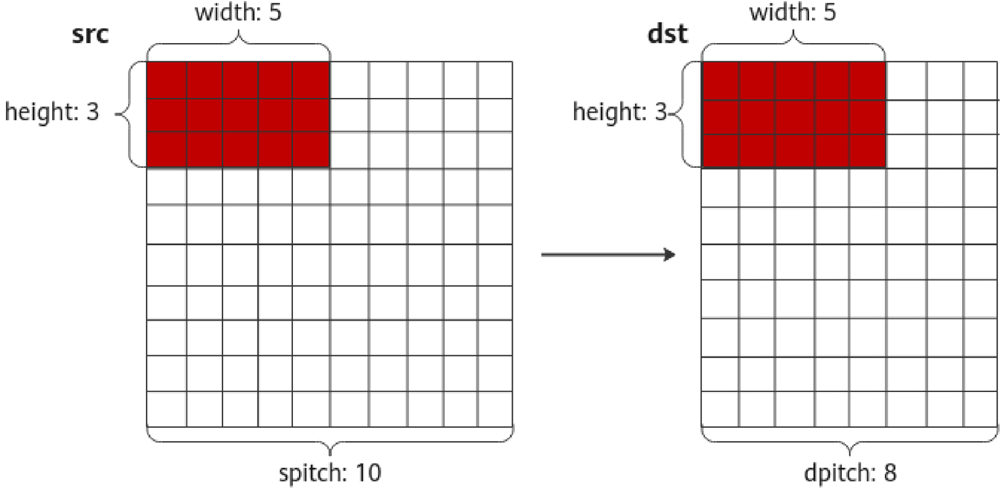

# aclrtMemcpy2d

> **Section**: 1.13.22

## 产品支持情况

## 功能说明

## 函数原型

## 参数说明

## 返回值说明

| 产品                               | 是否支持   |
|----------------------------------|--------|
| Atlas 350 加速卡                    | √      |
| Atlas A3 训练系列产品 /Atlas A3 推理系列产品 | √      |
| Atlas A2 训练系列产品 /Atlas A2 推理系列产品 | √      |
| Atlas 200I/500 A2 推理产品           | √      |
| Atlas 推理系列产品                     | √      |
| Atlas 训练系列产品                     | √      |

实现同步内存复制，主要用于矩阵数据的复制。

aclError aclrtMemcpy2d(void *dst, size\_t dpitch, const void *src, size\_t spitch, size\_t width, size\_t height, aclrtMemcpyKind kind)

| 参数名    | 输入 / 输 出   | 说明                                |
|--------|------------|-----------------------------------|
| dst    | 输入         | 目的内存地址指针。                         |
| dpitch | 输入         | 目的内存中相邻两列向量的地址距离。                 |
| src    | 输入         | 源内存地址指针。                          |
| spitch | 输入         | 源内存中相邻两列向量的地址距离。                  |
| width  | 输入         | 待复制的数据宽度。                         |
| height | 输入         | 待复制的数据高度。                         |
| kind   | 输入         | 内存复制的类型。类型定义请参见 aclrtMemcpyKind 。 |

返回 0 表示成功，返回其他值表示失败，请参见 1.28.1 aclError 。

## 约束说明

## 参考资源

- 当前仅支持 ACL\_MEMCPY\_HOST\_TO\_DEVICE 类型和 ACL\_MEMCPY\_DEVICE\_TO\_HOST 类型的内存复制。
- 对于 Atlas 推理系列产品， Control CPU 开放形态下，不支持调用本接口。另外， Atlas 推理系列加速模块产品也不支持本接口
- 对于 Atlas 200I/500 A2 推理产品， Ascend RC 形态下，不支持调用本接口。

## 本接口的内存复制示意图：

复制数据时，顺序为：每一行是从左到右，两行之间从上到下

**[Image: figure_2357.png (1529x750, 71.8KB)]**
