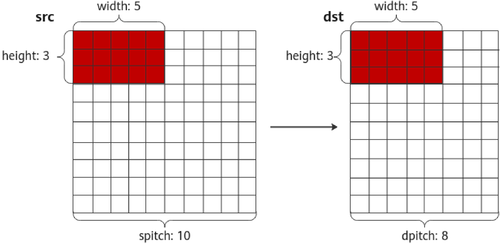

# aclrtMemcpy2dAsync

> **Section**: 1.13.23

## 产品支持情况

## 功能说明

| 产品                               | 是否支持   |
|----------------------------------|--------|
| Atlas 350 加速卡                    | √      |
| Atlas A3 训练系列产品 /Atlas A3 推理系列产品 | √      |
| Atlas A2 训练系列产品 /Atlas A2 推理系列产品 | √      |
| Atlas 200I/500 A2 推理产品           | √      |
| Atlas 推理系列产品                     | √      |
| Atlas 训练系列产品                     | √      |

实现异步内存复制，主要用于矩阵数据的复制。异步接口。

## 函数原型

## 参数说明

## 返回值说明

## 约束说明

本接口中的 Host 内存支持锁页内存（例如通过 aclrtMallocHost 接口申请的内存）、非 锁页内存（通过 malloc 接口申请的内存）。当 Host 内存是非锁页内存时，本接口在内 存复制任务完成后才返回；当 Host 内存是锁页内存时，本接口是异步接口，调用接口 成功仅表示任务下发成功，不表示任务执行成功，调用本接口后，需调用同步等待接 口（例如， aclrtSynchronizeStream ）确保内存复制的任务已执行完成。

aclError aclrtMemcpy2dAsync(void *dst, size\_t dpitch, const void *src, size\_t spitch, size\_t width, size\_t height, aclrtMemcpyKind kind, aclrtStream stream)

| 参数名    | 输入 / 输 出   | 说明                                                        |
|--------|------------|-----------------------------------------------------------|
| dst    | 输入         | 目的内存地址指针。                                                 |
| dpitch | 输入         | 目的内存中相邻两列向量的地址距离。                                         |
| src    | 输入         | 源内存地址指针。                                                  |
| spitch | 输入         | 源内存中相邻两列向量的地址距离。                                          |
| width  | 输入         | 待复制的数据宽度。 width 最大设置为 5000000 ，且必须小于或等于 dpitch 和 spitch 。 |
| height | 输入         | 待复制的数据高度。 height 最大设置为 5*1024*1024=5242880 ，否则接口返回失 败。    |
| kind   | 输入         | 内存复制的类型。类型定义请参见 aclrtMemcpyKind 。                         |
| stream | 输入         | 指定执行内存复制任务的 Stream 。类型定义请参见 aclrtStream 。                 |

返回 0 表示成功，返回其他值表示失败，请参见 1.28.1 aclError 。

- 本接口仅支持 ACL\_MEMCPY\_HOST\_TO\_DEVICE 、

ACL\_MEMCPY\_DEVICE\_TO\_HOST 或 ACL\_MEMCPY\_DEVICE\_TO\_DEVICE 内存复 制类型，且不同型号支持的类型不同。对于不支持的内存复制类型，接口返回 ACL\_ERROR\_INVALID\_PARAM 。

- -ACL\_MEMCPY\_HOST\_TO\_DEVICE 、 ACL\_MEMCPY\_DEVICE\_TO\_HOST 类 型，以下型号支持：

Atlas 350 加速卡

Atlas A3 训练系列产品 /Atlas A3 推理系列产品

Atlas A2 训练系列产品 /Atlas A2 推理系列产品

Atlas 200I/500 A2 推理产品

## 参考资源

Atlas 推理系列产品

Atlas 训练系列产品

- -ACL\_MEMCPY\_DEVICE\_TO\_DEVICE 类型，以下型号支持：

Atlas 350 加速卡

Atlas A3 训练系列产品 /Atlas A3 推理系列产品

Atlas A2 训练系列产品 /Atlas A2 推理系列产品

- 对于 Atlas 推理系列产品， Control CPU 开放形态下，不支持调用本接口。另外， Atlas 推理系列加速模块产品也不支持本接口
- 对于 Atlas 200I/500 A2 推理产品， Ascend RC 形态下，不支持调用本接口。

## 本接口的内存复制示意图：

复制数据时，顺序为：每一行是从左到右，两行之间从上到下

**[Image: figure_2389.png (1529x749, 71.8KB)]**
