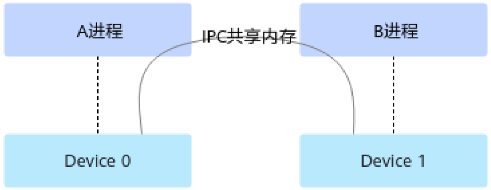

# aclrtIpcMemGetExportKey

> **Section**: 1.13.64

## 产品支持情况

| 产品                               | 是否支持   |
|----------------------------------|--------|
| Atlas 350 加速卡                    | √      |
| Atlas A3 训练系列产品 /Atlas A3 推理系列产品 | √      |
| Atlas A2 训练系列产品 /Atlas A2 推理系列产品 | √      |
| Atlas 200I/500 A2 推理产品           | ☓      |
| Atlas 推理系列产品                     | √      |
| Atlas 训练系列产品                     | √      |

## 功能说明

## 函数原型

## 参数说明

在本进程中将指定 Device 内存设置为 IPC （ Inter-Process Communication ）共享内存， 并返回共享内存 key ，以便后续将内存共享给其它进程。

本接口需与以下其它关键接口配合使用，以便实现内存共享，此处以 A 、 B 进程为例， 说明两个进程间的内存共享接口调用流程 :

## 1. 在 A 进程中：

- a. 调用 aclrtMalloc 接口申请内存。
- b. 调用 aclrtIpcMemGetExportKey 接口导出共享内存 key 。 aclrtIpcMemGetExportKey

调用 接口时，可指定是否启用进程白名单校验， 若启用，则需单独调用 aclrtIpcMemSetImportPid 接口将 B 进程的进程 ID 设 置为白名单；反之，则无需调用 aclrtIpcMemSetImportPid 接口。

- c. 调用 aclrtIpcMemClose 接口关闭 IPC 共享内存。 B aclrtIpcMemClose IPC A IPC 共

进程调用 接口关闭 共享内存后， 进程再关闭 享内存，否则可能导致异常。

- d. 调用 aclrtFree 接口释放内存。

## 2. 在 B 进程中：

- a. 调用 aclrtDeviceGetBareTgid 接口，获取 B 进程的进程 ID 。 ID

本接口内部在获取进程 时已适配物理机、虚拟机场景，用户只需调用本接 口获取进程 ID ，再配合其它接口使用，达到内存共享的目的。若用户不调用 本接口、自行获取进程 ID ，可能会导致后续使用进程 ID 异常。

- b. 调用 aclrtIpcMemImportByKey 获取 key 的信息，并返回本进程可以使用的 Device 内存地址指针。

调用 aclrtIpcMemImportByKey 接口前，需确保待共享内存存在，不能提前 释放。

- c. 调用 aclrtIpcMemClose 接口关闭 IPC 共享内存。

aclError aclrtIpcMemGetExportKey(void *devPtr, size\_t size, char *key, size\_t len, uint64\_t flags)

| 参数名    | 输入 / 输 出   | 说明                        |
|--------|------------|---------------------------|
| devPtr | 输入         | Device 内存地址。              |
| size   | 输入         | 内存大小，单位 Byte 。            |
| key    | 输出         | 共享内存 key ，是一个长度为 len 的数组。 |
| len    | 输入         | key 的长度，固定配置为 65 。        |

## 返回值说明

## 约束说明

## 接口调用示例

| 参数名   | 输入 / 输 出   | 说明                                                                                                                                                                                                                                                                                                                                                                              |
|-------|------------|---------------------------------------------------------------------------------------------------------------------------------------------------------------------------------------------------------------------------------------------------------------------------------------------------------------------------------------------------------------------------------|
| flags | 输入         | 是否启用进程白名单校验。 取值为如下宏： ● ACL_RT_IPC_MEM_EXPORT_FLAG_DEFAULT ：默认值， 启用进程白名单校验。 配置为该值时，需单独调用 aclrtIpcMemSetImportPid 接口将使用共享内存 key 的进程 ID 设置为白名单。 ● ACL_RT_IPC_MEM_EXPORT_FLAG_DISABLE_PID_VALID ATION ：关闭进程白名单校验。 配置为该值时，则无需调用 aclrtIpcMemSetImportPid 接口。 宏的定义如下： #define ACL_RT_IPC_MEM_EXPORT_FLAG_DEFAULT 0x0UL #define ACL_RT_IPC_MEM_EXPORT_FLAG_DISABLE_PID_VALIDATION 0x1UL |

返回 0 表示成功，返回其他值表示失败，请参见 1.28.1 aclError 。

不同 Device 上的两个进程通过 IPC 共享时，如下图， Device 0 上的 A 进程通过 IPC 方式将 内存共享给 Device 1 上的 B 进程，在 B 进程中使用此共享内存地址时：

- 在 Atlas 推理系列产品上，调用 aclrtMalloc 接口申请 Device 内存时， policy 处需选 择 P2P 类型，例如 ACL\_MEM\_MALLOC\_HUGE\_FIRST\_P2P 。
- 内存复制时，不支持根据源内存地址指针、目的内存地址指针自动判断复制方 向；不支持 Host-&gt;Device 或 Device-&gt;Host 方向的内存复制操作，同步复制、异步 复制都不支持；不支持同一个 Device 内的同步内存复制，但支持同一个 Device 内 的异步内存复制；
- 支持 Cube 计算单元、 Vector 计算单元跨片访问。

同一个 Device 上的两个进程通过 IPC 共享内存时，不存在以上约束。

**[Image: figure_3053.png (1101x427, 45.2KB)]**

接口调用示例，参见进程间通信。
