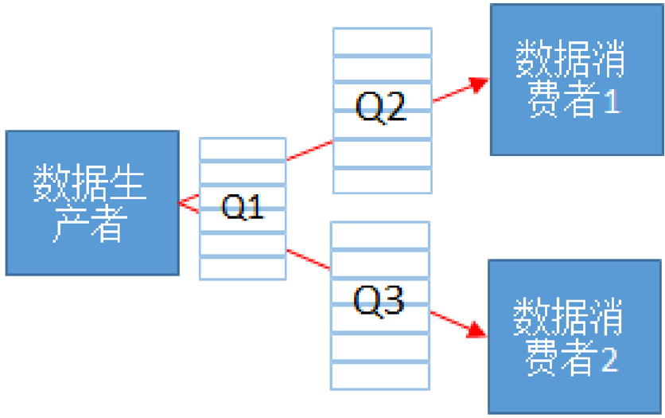

# acltdtBindQueueRoutes

> **Section**: 1.19.2.8

## 产品支持情况

| 产品                               | 是否支持   |
|----------------------------------|--------|
| Atlas 350 加速卡                    | √      |
| Atlas A3 训练系列产品 /Atlas A3 推理系列产品 | √      |
| Atlas A2 训练系列产品 /Atlas A2 推理系列产品 | √      |
| Atlas 200I/500 A2 推理产品           | √      |
| Atlas 推理系列产品                     | √      |
| Atlas 训练系列产品                     | √      |

## 功能说明

## 函数原型

## 参数说明

## 返回值说明

## 约束说明

当应用存在数据一对多分发时，通过本接口绑定队列间数据转发路由关系。

如下图所示，可以建立两条路由关系 Q1-&gt;Q2 ， Q1-&gt;Q3 。数据一对多分发时，传递的 共享 Buffer 数据是无锁的，消费者不能对数据进行 inplace 操作，如下图所示消费者 1 对 共享数据的修改会导致消费者 2 访问的数据发生变化。

**[Image: figure_4653.png (836x525, 39.6KB)]**

aclError acltdtBindQueueRoutes(acltdtQueueRouteList *qRouteList)

| 参数名        | 输入 / 输 出   | 说明                                                                                                                                                           |
|------------|------------|--------------------------------------------------------------------------------------------------------------------------------------------------------------|
| qRouteList | 输入 / 输 出   | 路由关系数组的指针，接口调用完成后返回路由绑定结 果。类型定义请参见 acltdtQueueRouteList 。 需提前调用 acltdtCreateQueueRouteList 接口创建 acltdtQueueRouteList 类型的数据，再调用 acltdtAddQueueRoute 接口添加路由关系。 |

返回 0 表示成功，返回其他值表示失败，请参见 1.28.1 aclError 。

只有当所有队列关系绑定成功且路由状态正常时，本接口才会返回成功；任何一条绑 定失败，本接口返回失败，如果您需要知道具体哪个路由关系绑定失败，您可以先调 用 acltdtGetQueueRoute 接口从路由关系数组中获取每一个路由关系，再调用 acltdtGetQueueRouteParam 接口查询绑定关系状态。

- 系统内部会对添加的队列路由关系校验是否成环，不允许成环。
- 不支持多线程并发调用。
