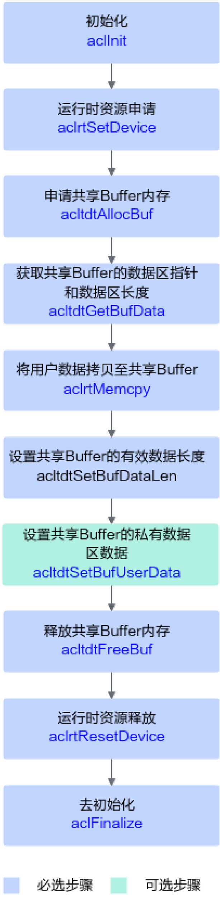

# 共享 Buffer 管理使用说明

> **Section**: 1.19.3.1


本特性提供了跨进程共享 Buffer 管理能力，可配合 1.19.2 共享队列管理一起使用。共 享 Buffer 的共享范围由共享队列的授权确定，共享范围包括'一主多从'的这些进程。

## 接口调用流程



**[Image: figure_4711.png (613x2492, 309.7KB)]**

关键接口的调用流程如上图所示，流程说明如下：

## 示例代码

1. 调用 aclInit 接口初始化系统。
2. 调用 aclrtSetDevice 接口指定计算设备。
3. 申请共享 Buffer 内存。

调用 acltdtAllocBuf 接口申请共享 Buffer 内存，此处需根据实际情况选择内存类 型。

4. 向共享 Buffer 中填充有效数据。

需先调用 acltdtGetBufData 接口获取共享 Buffer 的数据区指针和数据区长度，接着 调用 aclrtMemcpy 接口把用户数据复制到共享 Buffer 中，最后可调用 acltdtSetBufDataLen 接口设置有效数据长度，以便在多进程场景下调用 acltdtGetBufDataLen 接口获取有效数据长度，再根据有效数据长度获取共享 Buffer 中的数据。

5. 设置共享 Buffer 的私有数据区数据。

调用 acltdtSetBufUserData 接口设置共享 Buffer 的私有数据区数据，以便在多进程 场景下调用 acltdtGetBufUserData 接口获取共享 Buffer 的私有数据区数据。

6. 释放共享 Buffer 内存。

调用 acltdtFreeBuf 接口来释放共享 Buffer 。

7. 调用 aclrtResetDevice 接口复位设备，释放 Device 上的资源。
8. 调用 aclFinalize 接口实现系统去初始化，用于释放进程内 acl 接口使用的相关资 源。

以下是关键步骤的代码示例，不能直接拷贝编译运行，仅供参考。调用接口后，需增 加异常处理的分支，并记录报错日志、提示日志，此处不一一列举。

#include "acl/acl.h"

// 1. 初始化

// 此处的 .. 表示相对路径，相对可执行文件所在的目录 // 例如，编译出来的可执行文件存放在 out 目录下，此处的 .. 就表示 out 目录的上一级目录 const char *aclConfigPath = "../src/acl.json"; aclError ret = aclInit (aclConfigPath);

// 2. 运行时资源申请，指定计算设备，此处以 deviceId = 0 为例 ret = aclrtSetDevice (0);

// 3. 申请 mbuf 内存并进行内存管理，此处以申请 DVPP 内存、内存大小 1024U 为例

size\_t size = 1024U;

acltdtBuf buf;

ret =

acltdtAllocBuf (size, ACL\_TDT\_DVPP\_MEM, &amp;buf);

// 4. 向共享 Buffer 中填充有效数据

// 4.1 获取共享 Buffer 的数据区指针和数据区长度

void *dataPtr = nullptr;

size\_t dataSize = 0U;

ret = acltdtGetBufData (buf, &amp;dataPtr, &amp;dataSize);

// 4.2 把用户数据拷贝到共享 Buffer 中

size\_t len = 512U; // 用户数据长度

void *ptr = new (std::nothrow) char\_t[len];  // 用户申请自己的内存

// 用户对自己申请的数据进行处理

// ……

ret =

aclrtMemcpy (dataPtr, size, ptr, len, ACL\_MEMCPY\_HOST\_TO\_DEVICE);

// 5.

释放内存

delete[] ptr;

ptr = nullptr;

delete[] newPtr;

newPtr = nullptr;

## 功能说明

## 函数原型

## 参数说明

```
ret = acltdtFreeBuf (buf); // 6. 运行时资源释放 ret = aclrtResetDevice (0); // 7. 去初始化 ret = aclFinalize ();
```
