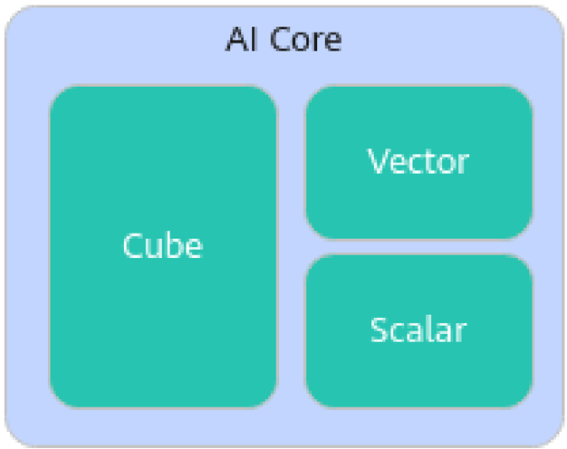
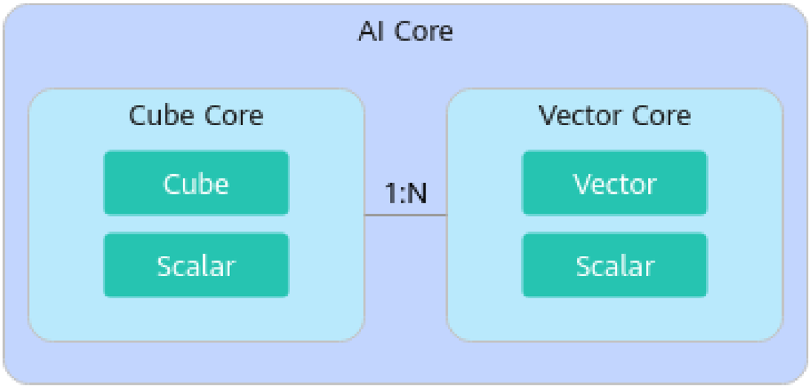
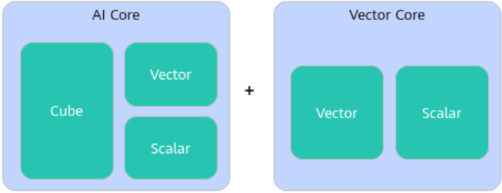
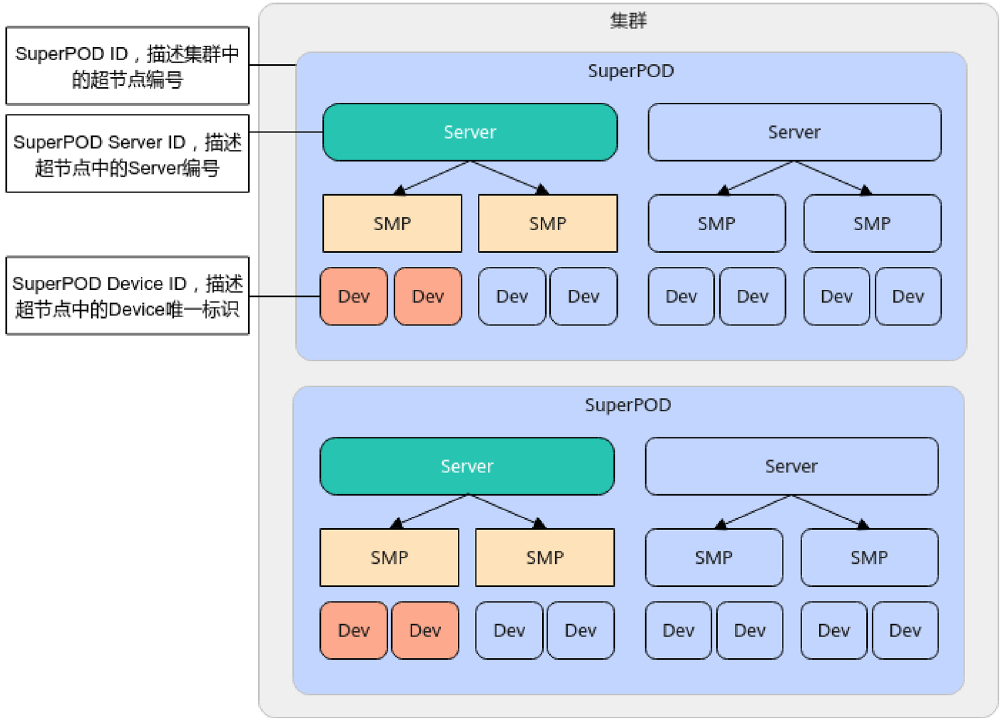

# aclrtDevAttr

> **Section**: 1.28.45


定义

```
typedef enum { ACL_DEV_ATTR_AICPU_CORE_NUM  = 1,
```

```
ACL_DEV_ATTR_AICORE_CORE_NUM = 101, ACL_DEV_ATTR_CUBE_CORE_NUM = 102, ACL_DEV_ATTR_VECTOR_CORE_NUM = 201, ACL_DEV_ATTR_WARP_SIZE = 202, ACL_DEV_ATTR_MAX_THREAD_PER_VECTOR_CORE, ACL_DEV_ATTR_UBUF_PER_VECTOR_CORE, ACL_DEV_ATTR_TOTAL_GLOBAL_MEM_SIZE = 301, ACL_DEV_ATTR_L2_CACHE_SIZE, ACL_DEV_ATTR_SMP_ID = 401U, ACL_DEV_ATTR_PHY_CHIP_ID = 402U, ACL_DEV_ATTR_SUPER_POD_DEVICE_ID = 403U, ACL_DEV_ATTR_SUPER_POD_SERVER_ID = 404U, ACL_DEV_ATTR_SUPER_POD_ID = 405U, ACL_DEV_ATTR_CUST_OP_PRIVILEGE = 406U, ACL_DEV_ATTR_MAINBOARD_ID = 407U, ACL_DEV_ATTR_IS_VIRTUAL = 501U, } aclrtDevAttr;
```

表 1-8 枚举项说明

| 枚举项                                      | 说明                                                                                                                                |
|------------------------------------------|-----------------------------------------------------------------------------------------------------------------------------------|
| ACL_DEV_ATTR_AICPU_COR E_NUM             | AI CPU 数量。                                                                                                                        |
| ACL_DEV_ATTR_AICORE_CO RE_NUM            | AI Core 数量。                                                                                                                       |
| ACL_DEV_ATTR_CUBE_CORE _NUM              | Cube Core 数量。                                                                                                                     |
| ACL_DEV_ATTR_VECTOR_CO RE_NUM            | Vector Core 数量。                                                                                                                   |
| ACL_DEV_ATTR_WARP_SIZE                   | 一个 Warp 里的线程数，在 SIMT （单指令多线程， Single Instruction Multiple Thread ）编程模型中， Warp 是指执行相同指令的线程集合。 仅 Atlas 350 加速卡支持该选项其它产品型号当前不 支持该选项。 |
| ACL_DEV_ATTR_MAX_THRE AD_PER_VECTOR_CORE | 每个 VECTOR_CORE 上可同时驻留的最大线程数。 仅 Atlas 350 加速卡支持该选项其它产品型号当前不 支持该选项。                                                                 |
| ACL_DEV_ATTR_UBUF_PER_ VECTOR_CORE       | 每个 VECTOR_CORE 上可以使用的最大 UB buffer 的 大小，单位 Byte 。 仅 Atlas 350 加速卡支持该选项其它产品型号当前不 支持该选项。                                             |
| ACL_DEV_ATTR_TOTAL_GLO BAL_MEM_SIZE      | Device 上的可用总内存，单位 Byte 。                                                                                                          |
| ACL_DEV_ATTR_L2_CACHE_ SIZE              | L2 Cache （二级缓存）大小，单位 Byte 。                                                                                                       |
| ACL_DEV_ATTR_SMP_ID                      | SMP （ Symmetric Multiprocessing ） ID ，用于标识 设备是否运行在同一操作系统上。                                                                        |

| 枚举项                               | 说明                                                                                                                     |
|-----------------------------------|------------------------------------------------------------------------------------------------------------------------|
| ACL_DEV_ATTR_PHY_CHIP_I D         | 芯片物理 ID 。                                                                                                              |
| ACL_DEV_ATTR_SUPER_POD _DEVICE_ID | SuperPOD Device ID 表示超节点产品中的 Device 标 识。                                                                               |
| ACL_DEV_ATTR_SUPER_POD _SERVER_ID | SuperPOD Server ID 表示超节点产品中的服务器标 识。                                                                                    |
| ACL_DEV_ATTR_SUPER_POD _ID        | SuperPOD ID 表示集群中的超节点 ID 。                                                                                             |
| ACL_DEV_ATTR_CUST_OP_P RIVILEGE   | 表示查询自定义算子是否可以执行更多的系统调用 权限。 取值如下： ● 0 ：自定义算子执行系统调用权限受控（例如不 能执行 Write 操作）。 ● 1 ：自定义算子可以执行更多的系统调用权限。 Atlas 350 加速卡不支持该选项。 |
| ACL_DEV_ATTR_MAINBOAR D_ID        | 主板 ID 。                                                                                                                |
| ACL_DEV_ATTR_IS_VIRTUAL           | 是否为 昇 腾虚拟化实例。 ● 0 ：不是 昇 腾虚拟化实例，是物理机。 ● 1 ：是 昇 腾虚拟化实例，可能是虚拟机或容器。                                                        |

## 了解 AI Core 、 Cube Core 、 Vector Core 的关系

为便于理解 AI Core 、 Cube Core 、 Vector Core 的关系，此处先明确 Core 的定义， Core 是指拥有独立 Scalar 计算单元的一个计算核，通常 Scalar 计算单元承担了一个计算核的 SIMD （单指令多数据， Single Instruction Multiple Data ）指令发射等功能，所以我 们也通常也把这个 Scalar 计算单元称为核内的调度单元。不同产品上的 AI 数据处理核心 单元不同，当前分为以下几类：

- 当 AI 数据处理核心单元是 AI Core ：
- -在 AI Core 内， Cube 和 Vector 共用一个 Scalar 调度单元，例如 Atlas 训练系列 产品。



**[Image: figure_6625.png (626x496, 29.7KB)]**

- -在 AI Core 内， Cube 和 Vector 都有各自的 Scalar 调度单元，因此又被称为 Cube Core 、 Vector Core 。这时，一个 Cube Core 和一组 Vector Core 被定义为一个 AI Core ， AI Core 数量通常是以多少个 Cube Core 为基准计算的，例如 Atlas A2 训练系列产品 /Atlas A2 推理系列产品。
- 当 AI 数据处理核心单元是 AI Core 以及单独的 Vector Core ： AI Core 和 Vector Core 都拥有独立的 Scalar 调度单元，例如 Atlas 推理系列产品。



**[Image: figure_6628.png (1091x523, 48.2KB)]**



**[Image: figure_6629.png (1361x525, 54.3KB)]**

## 了解 SuperPOD ID 、 SuperPOD Server ID 、 SuperPOD Device ID 之间的关系



**[Image: figure_6631.png (1596x1146, 232.3KB)]**
