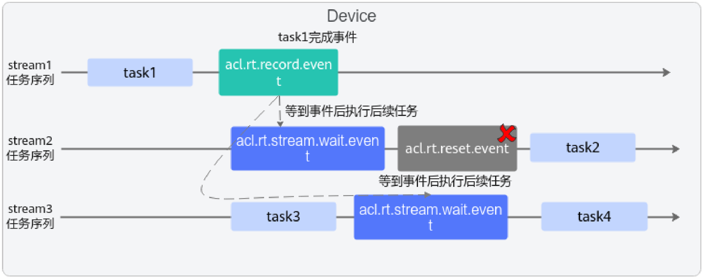

# 函数： reset\_event

> **Section**: 2.10.6

## 产品支持情况

## 功能说明

## 函数原型

## 参数说明

## 返回值说明

| 产品                                | 是否支持   |
|-----------------------------------|--------|
| Atlas 350 加速卡                     | √      |
| Atlas A3 训练系列产品 /Atlas A3 推理系 列产品 | √      |
| Atlas A2 训练系列产品 /Atlas A2 推理系 列产品 | √      |
| Atlas 训练系列产品                      | √      |
| Atlas 推理系列产品                      | √      |
| Atlas 200I/500 A2 推理产品            | √      |

复位一个 Event 。用户需确保等待 Stream 中的任务都完成后，再复位 Event ，异步接 口。

- C 函数原型

aclError aclrtResetEvent(aclrtEvent event, aclrtStream stream)

- python 函数

ret = acl.rt.reset\_event(event, stream)

| 参数名    | 说明                                |
|--------|-----------------------------------|
| event  | int ，待复位的 Event 对象的指针地址。          |
| stream | int ，指定 Event 所在的 Stream 的对象指针地址。 |

| 返回值   | 说明                            |
|-------|-------------------------------|
| ret   | int ，错误码，返回 0 表示成功，返回其它值表示失败。 |

## 约束说明

仅支持复位由 acl.rt.create\_event\_with\_flag 接口创建的、带有 ACL\_EVENT\_SYNC 标 志的 Event 。

注意，在多个 Stream 中的任务需要等待同一个 Event 的情况下，不建议调用此接口来复 位 Event 。如图所示，如果在 stream2 中的 aclrtStreamWaitEvent 接口之后调用 aclrtResetEvent 接口， Event 将被复位，这会导致 stream3 中的 aclrtStreamWaitEvent 接口无法成功。

**[Image: figure_8713.png (1584x625, 139.0KB)]**
