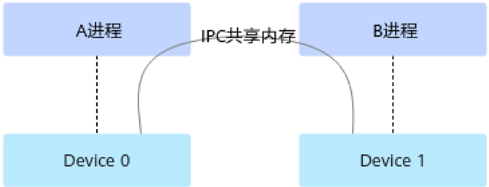

# 函数： ipc\_mem\_get\_export\_key

> **Section**: 2.12.43

## 产品支持情况

## 功能说明

| 参数名     | 说明                                                                                                                                                                                                                                                                                           |
|---------|----------------------------------------------------------------------------------------------------------------------------------------------------------------------------------------------------------------------------------------------------------------------------------------------|
| devAddr | int ， Device 侧内存地址。 dev_addr 的有效内存位宽为 64bit 。                                                                                                                                                                                                                                                |
| value   | int ，需与内存中的数据作比较的值。                                                                                                                                                                                                                                                                          |
| flag    | int ，比较的方式，等满足条件后解除阻塞。取值如下： ACL_STREAM_WAIT_VALUE_GEQ = 0x0; # 等到 (int64_t)(*devAddr - value) >= 0 ACL_STREAM_WAIT_VALUE_EQ = 0x1; # 等到 *devAddr == value ACL_STREAM_WAIT_VALUE_AND = 0x2; # 等到 (*devAddr & value) != 0 ACL_STREAM_WAIT_VALUE_NOR = 0x3; # 等到 ~ (*devAddr &#124; value) != 0 |
| stream  | int ，指定 stream 。此处支持传 0 ，表示使用默认 Stream 。                                                                                                                                                                                                                                                     |

| 产品                                | 是否支持   |
|-----------------------------------|--------|
| Atlas 350 加速卡                     | √      |
| Atlas A3 训练系列产品 /Atlas A3 推理系 列产品 | √      |
| Atlas A2 训练系列产品 /Atlas A2 推理系 列产品 | √      |
| Atlas 训练系列产品                      | √      |
| Atlas 推理系列产品                      | √      |
| Atlas 200I/500 A2 推理产品            | x      |

在本进程中将指定 Device 内存设置为 IPC （ Inter-Process Communication ）共享内存， 并返回共享内存 key ，以便后续将内存共享给其它进程。本接口需与以下其它关键接口 配合使用，以便实现内存共享，此处以 A 、 B 进程为例，说明两个进程间的内存共享接 口调用流程 :

## 函数原型

## 参数说明

## 1. 在 A 进程中：

- a. 若为不同 Device 上的两个进程共享内存场景，调用 acl.rt.device\_enable\_peer\_access 接口使能 P2P 。
- b. 调用 acl.rt.malloc 接口申请 P2P 内存（通过该接口的 policy 参数配置）。
- c. 调用 acl.rt.ipc\_mem\_get\_export\_key 接口导出共享内存 key 。
- d. 获取 B 进程的进程 ID ，并调用 acl.rt.ipc\_mem\_set\_import\_pid 接口，将 B 进程 的进程 ID 设置为白名单。
- e. 调用 acl.rt.ipc\_mem\_close 接口关闭 IPC 共享内存。 B 进程调用 acl.rt.ipc\_mem\_close 接口关闭 IPC 共享内存后， A 进程再关闭 IPC 共享内存，否则 可能导致异常。
- f. 调用 acl.rt.free 接口释放内存。

## 2. 在 B 进程中：

- a. 若为不同 Device 上的两个进程共享内存场景，调用 acl.rt.device\_enable\_peer\_access 接口使能 P2P 。
- b. 调用 acl.rt.device\_get\_bare\_tgid 接口，获取 B 进程的进程 ID 。
3. 本接口内部在获取进程 ID 时已适配物理机、虚拟机场景，用户只需调用本接口获 取进程 ID ，再配合其它接口使用，达到内存共享的目的。若用户不调用本接口、 自行获取进程 ID ，可能会导致后续使用进程 ID 异常。
- c. 调用 aclrtIpcMemImportByKey 获取 key 的信息，并返回本进程可以使用的 Device 内存地址指针。

在调用 acl.rt.ipc\_mem\_import\_by\_key 接口前，需确保待共享内存存在，不能提 前释放。

- d. 调用 acl.rt.ipc\_mem\_close 接口关闭 IPC 共享内存。

## ● C 函数原型

aclError aclrtIpcMemGetExportKey(void *devPtr, size\_t size, char *key, size\_t len, uint64\_t flag)

## ● python 函数

key, ret = acl.rt.ipc\_mem\_get\_export\_key(dev\_ptr, size, len, flags)

| 参数名     | 说明                       |
|---------|--------------------------|
| dev_ptr | int ， Device 内存地址。       |
| size    | int ，内存大小，单位 Byte 。      |
| len     | int ， key 的长度，固定配置为 65 。 |

## 返回值说明

## 约束说明

| 参数名   | 说明                                                                                                                                                                                                                                                                                                                                                                                                |
|-------|---------------------------------------------------------------------------------------------------------------------------------------------------------------------------------------------------------------------------------------------------------------------------------------------------------------------------------------------------------------------------------------------------|
| flags | int ，是否启用进程白名单校验。 取值为如下宏： ● ACL_RT_IPC_MEM_EXPORT_FLAG_DEFAULT ：默认值，启用进 程白名单校验。 配置为该值时，需单独调用 acl.rt.ipc_mem_set_import_pid 接 口将使用共享内存 key 的进程 ID 设置为白名单。 ● ACL_RT_IPC_MEM_EXPORT_FLAG_DISABLE_PID_VALIDATION ：关闭进程白名单校验。 配置为该值时，则无需调用 acl.rt.ipc_mem_set_import_pid 接 口。 宏的定义如下： #define ACL_RT_IPC_MEM_EXPORT_FLAG_DEFAULT 0x0UL #define ACL_RT_IPC_MEM_EXPORT_FLAG_DISABLE_PID_VALIDATION 0x1UL |

| 返回值   | 说明                        |
|-------|---------------------------|
| key   | str ，共享内存 key 。           |
| ret   | int ，返回 0 表示成功，返回其它值表示失败。 |

不同 Device 上的两个进程通过 IPC 共享时，如下图， Device 0 上的 A 进程通过 IPC 方式将 内存共享给 Device 1 上的 B 进程，在 B 进程中使用此共享内存地址时：

- 需配合 acl.rt.device\_enable\_peer\_access 接口使用，使能 2 个 Device 之间的通 信。
- 在 Atlas 推理系列产品上，调用 aclrtMalloc 接口申请 Device 内存时， policy 处需选 择 P2P 类型，例如 ACL\_MEM\_MALLOC\_HUGE\_FIRST\_P2P 。
- 内存复制时，不支持根据源内存地址指针、目的内存地址指针自动判断复制方 向；不支持 Host-&gt;Device 或 Device-&gt;Host 方向的内存复制操作，同步复制、异步 复制都不支持；不支持同一个 Device 内的同步内存复制，但支持同一个 Device 内 的异步内存复制；
- 支持 Cube 计算单元、 Vector 计算单元跨片访问。

**[Image: figure_9958.png (1096x420, 45.0KB)]**

同一个 Device 上的两个进程通过 IPC 共享内存时，不存在以上约束。
