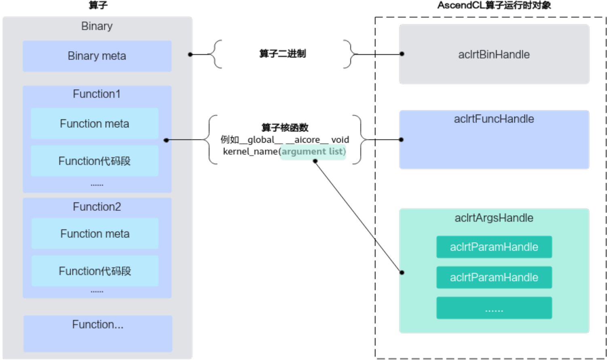
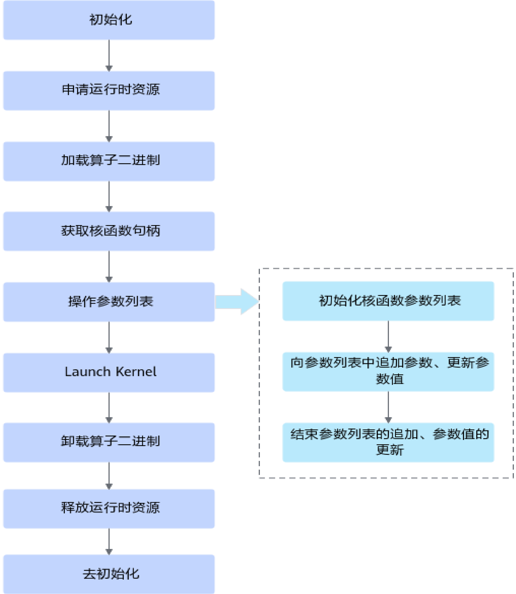
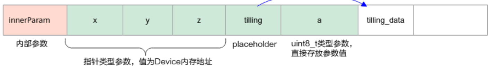

# 概念及使用说明

> **Section**: 2.15.1

## 相关概念

本章中的接口涉及对算子的算子二进制、核函数、核函数参数列表以及参数的操作， 为便于理解，您可以先通过下图了解它们之间的关系。

**[Image: figure_10335.png (1506x893, 167.4KB)]**

- 算子二进制：编译算子源码，可得到算子二进制文件 *.o 。对于 CANN 内置算子， 可从算子二进制包（包名为 Ascend-cann-kernels-*.run ）中获取算子二进制文 件。对于自定义算子，可在编译算子、发布二进制之后获取算子二进制文件。自 定义算子的开发、编译请参见《 Ascend C 算子开发》。
- 核函数：是算子设备侧实现的入口函数。当前允许使用 C/C++ 函数的语法扩展来编 写设备端的运行代码，用户在核函数中进行数据访问和计算操作，由此实现该算 子的所有功能。

## Kernel 加载与执行接口调用流程

**[Image: figure_10339.png (1575x1812, 250.6KB)]**

## 关键流程说明如下：

1. 调用 acl.init 接口初始化。
2. 申请运行时资源，包括调用 acl.rt.set\_device 接口指定用于运算的 Device 、调用 acl.rt.create\_stream 接口创建 Stream 。
3. 详细说明请参见运行时资源申请与释放。
3. 调用 acl.rt.binary\_load\_from\_file 接口加载算子二进制文件。
4. 调用 acl.rt.binary\_get\_function 接口获取核函数句柄。
5. 根据核函数句柄操作其参数列表，操作包括：
- a. 初始化参数列表

当前支持由系统管理内存（调用 acl.rt.kernel\_args\_init 接口）、由用户管理 内存（调用 acl.rt.kernel\_args\_init\_by\_user\_mem 接口）两种方式。

## b. 追加参数、更新参数值

核函数参数列表中包含不同类型的参数，例如指针类型参数、 placeholder 、 uint8\_t 类型参数等，其中：

- 指针类型参数：其值为 Device 内存地址。一般来说，算子的输入、输出 是该种类型的参数，用户需提前调用 Device 内存申请接口（例如 acl.rt.malloc 接口）申请内存，并自行拷贝数据至 Device 侧。
- placeholder ：也是指针类型参数，但区别在于，用户无需手动将参数数 据复制到 Device ，这项操作由 Runtime 完成。在追加参数时 Runtime 并不 会填写真实的 Device 地址，而是在 Launch Kernel 时才会刷新为真实的 Device 地址，所以称之为 placeholder 。对算子的非输入、输出参数，可 以使用 placeholder 方式，将小块数据（建议小于 2KB ）的 Host-&gt;Device 拷贝合并到 Launch Kernel 时的一次拷贝操作中去，减少拷贝次数，提升 性能。

## 图中以此核函数为例：

\_global\_\_aicore\_ void kernel\_name(\_gm\_ uint8\_t *x, \_gm\_ uint8\_t *y, \_gm\_\_ uint8\_t *z,\_gm\_ uint8\_t *tiling, uint8\_t a)

**[Image: figure_10355.png (1409x193, 53.3KB)]**

## 不同类型参数，可调用不同的参数追加接口：

- 对于 placeholder 追加参数时，先调用 acl.rt.kernel\_args\_append\_place\_holder 接口占
- 参数，由于关联的内存必须放在所有参数之后，所以在 位，等所有参数都追加之后，可调用 acl.rt.kernel\_args\_get\_place\_holder\_buffer 接口获取对应占位符指向
- 的内存地址。用户可根据获取的内存地址，管理该内存中的数据。
- 对于非 placeholder 参数（例如指针类型参数、 uint8\_t 类型参数等），调 用 acl.rt.kernel\_args\_append 接口将用户设置的参数值追加拷贝到 argsHandle 指向的参数数据区域。如果要更新参数值，可调用 acl.rt.kernel\_args\_para\_update 接口进行更新。

注意，核函数参数列表中，实际可能存在多个参数，并且不同类型的参数可 能交错出现，因此需要按照参数列表中的参数顺序从左到右进行追加，追加 的参数最多支持 128 个。

## c. 结束参数列表的追加、参数值的更新

在所有参数追加之后，调用 acl.rt.kernel\_args\_finalize 接口以标识参数组装 完毕。但 acl.rt.kernel\_args\_finalize 接口之后，也支持继续更新参数值，更 新之后，还要再调用一次 acl.rt.kernel\_args\_finalize 接口。

6. 调用 acl.rt.launch\_kernel\_with\_config 接口 Launch Kernel ，启动对应算子的计 算任务。
7. 调用接口 acl.rt.binary\_unload 卸载算子二进制文件。
8. 释放运行时资源，包括调用 acl.rt.destroy\_stream 接口释放 Stream 、调用 acl.rt.reset\_device 接口释放 Device 上的资源。 详细说明请参见运行时资源申请与释放。
9. 调用 acl.finalize 接口去初始化。
