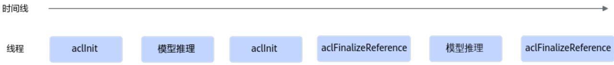
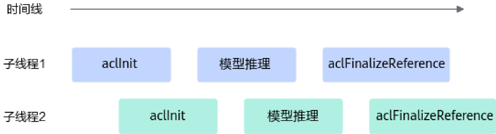

# 初始化 &amp; 去初始化

> **Section**: 2.5


- 2.5.1

## 函数： init

## 产品支持情况

## 功能说明

| 产品                                | 是否支持   |
|-----------------------------------|--------|
| Atlas 350 加速卡                     | √      |
| Atlas A3 训练系列产品 /Atlas A3 推理系 列产品 | √      |
| Atlas A2 训练系列产品 /Atlas A2 推理系 列产品 | √      |
| Atlas 训练系列产品                      | √      |
| Atlas 推理系列产品                      | √      |
| Atlas 200I/500 A2 推理产品            | √      |

初始化函数。

## 函数原型

- C 函数原型 aclError aclInit(const char *configPath)

## ● python 函数

- ret = acl.init(config\_path)

## 参数说明

| 参数名          | 说明                                                                                                                                                                                                                                                                                                                                                                                                                                                                                                                                                                                                                                                                                                                                                                                                                                                                                                                                                                                                                                                                                                                                                                                                                                                                                     |
|--------------|----------------------------------------------------------------------------------------------------------------------------------------------------------------------------------------------------------------------------------------------------------------------------------------------------------------------------------------------------------------------------------------------------------------------------------------------------------------------------------------------------------------------------------------------------------------------------------------------------------------------------------------------------------------------------------------------------------------------------------------------------------------------------------------------------------------------------------------------------------------------------------------------------------------------------------------------------------------------------------------------------------------------------------------------------------------------------------------------------------------------------------------------------------------------------------------------------------------------------------------------------------------------------------------|
| config_pat h | 配置文件所在的路径，包含文件名。 配置文件内容为 JSON 格式（ JSON 文件内的' { '的层级最多为 10 ， ' [ '的层级最多为 10 ）。如果以下的默认配置已满足需求，无需修 改，可直接调用 acl.init 接口不传入参数或者可将配置文件配置为空 JSON 串（即配置文件中只有 {} ）。 配置文件格式为 JSON 格式，当前支持以下配置： ● Dump 信息配置，包括以下配置（如果算子输入或输出中包含用户 的敏感信息，则存在信息泄露风险）。 - 模型 Dump 配置（用于导出模型中每一层算子输入和输出数 据）、单算子 Dump 配置（用于导出单个算子的输入和输出数 据），导出的数据用于与指定模型或算子进行比对，定位精度 问题，配置示例、说明及约束请参见模型 Dump 配置、单算子 Dump 配置示例。默认不启用该 dump 配置。 - 异常算子 Dump 配置（用于导出异常算子的输入输出数据、 workspace 信息、 Tiling 信息），导出的数据用于分析 AI Core Error 问题，配置示例请参见异常算子 Dump 配置示例。默认不 启用该 dump 配置。 - 溢出算子 Dump 配置（用于导出模型中溢出算子的输入和输出数 据），导出的数据用于分析溢出原因，定位模型精度的问题， 配置示例、说明及约束请参见溢出算子 Dump 配置示例。默认不 启用该 dump 配置。 - 算子 Dump Watch 模式配置（用于开启指定算子输出数据的观 察模式），在定位部分算子精度问题且已排除算子本身的计算 问题后，若怀疑被其它算子踩踏内存导致精度问题，可开启 Dump Watch 模式，配置示例及约束请参见算子 Dump Watch 模式配置示例。默认不开启 Dump Watch 模式。 - 算子 Kernel 调测信息 Dump 配置，用于导出 Ascend C 算子 Kernel 的调测信息，便于定位算子问题。默认不启用该 Dump 配 置。 仅如下型号支持该配置： Atlas 350 加速卡 Atlas A3 训练系列产品 /Atlas A3 推理系列产品 Atlas A2 训练系列产品 /Atlas A2 推理系列产品 Atlas 200I/500 A2 推理产品 Atlas 推理系列产品 ● Profiling 采集信息配置，示例、配置说明及约束请参见《性能调优 工具》。默认不启用 Profiling 采集信息配置。 ● 算子缓存信息老化配置，为节约内存和平衡调用性能，可通过 ' max_opqueue_num '参数配置'算子类型 - 单算子模型'映射 队列的最大长度，如果长度达到最大，则会先删除长期未使用的映 射信息以及缓存中的单算子模型，再加载最新的映射信息以及对应 的单算子模型。如果不配置映射队列的最大长度，则默认最大长度 为' 20000 '。示例及约束说明请参见算子缓存信息老化配置示 例。 |

| 参数名   | 说明                                                                                                                                                                                                                                                                                                                                                                                                                                                                                                                                                                                                                                                                                                                                                                                                                                                                                                                                                                                                                                                                                                                                                                                                                                                                                                                                  |
|-------|-------------------------------------------------------------------------------------------------------------------------------------------------------------------------------------------------------------------------------------------------------------------------------------------------------------------------------------------------------------------------------------------------------------------------------------------------------------------------------------------------------------------------------------------------------------------------------------------------------------------------------------------------------------------------------------------------------------------------------------------------------------------------------------------------------------------------------------------------------------------------------------------------------------------------------------------------------------------------------------------------------------------------------------------------------------------------------------------------------------------------------------------------------------------------------------------------------------------------------------------------------------------------------------------------------------------------------------|
|       | ● 错误信息上报模式配置，用于控制 acl.get_recent_err_msg 接口按 进程或线程级别获取错误信息，默认按线程级别。示例请参见错误 信息上报模式配置示例。 ● 默认 Device 配置（用于配置默认的计算设备），配置示例、说明请 参见默认 Device 配置示例 若同时通过 set_device 接口指定 Device ，则 aclrtSetDevice 接口优 先级高。 如果用户开启默认 Device 功能后，若需要显式创建 Context ，则需 要调用 set_device ，否则可能会导致业务异常。 ● AI Core 栈空间大小配置，用于控制进程中 Kernel 执行时为每个 AI Core 分配的栈空间大小，默认为 32K 字节。配置示例、使用说明请 参见 AI Core 栈空间大小配置示例。在编译 AI Core 算子时，只有打 开 O0 开关，此处配置的 AI Core 栈空间大小才有效， Atlas 350 加速 卡上不存在该限制。 仅如下型号支持该配置： Atlas 350 加速卡 Atlas A3 训练系列产品 /Atlas A3 推理系列产品 Atlas A2 训练系列产品 /Atlas A2 推理系列产品 Atlas 200I/500 A2 推理产品 ● SIMT （ Single Instruction Multiple Thread ）栈空间大小配置， 用于控制每个线程中 SIMT 算子的栈空间大小以及 SIMT 算子的分支 （ Divergence ）栈空间大小，单位 Byte 。仅 Atlas 350 加速卡支持 该配置。 ● SIMT （ Single Instruction Multiple Thread ） Printf 维测空间大 小配置，用于控制 SIMT 算子可以 Printf 打印的空间大小，单位 Byte 。仅 Atlas 350 加速卡支持该配置。 ● SIMD （ Single Instruction Multiple Data ） Printf 维测空间大小 配置，用于控制每个 Core 上 SIMD 算子可以 Printf 打印的空间大小， 单位 Byte 。仅如下型号支持该配置： Atlas 350 加速卡 Atlas A3 训练系列产品 /Atlas A3 推理系列产品 Atlas A2 训练系列产品 /Atlas A2 推理系列产品 ● Event 资源调度模式配置，用于在捕获方式构建模型运行实例场景 下控制 Event 资源的调度方式，配置示例、使用说明请参见 Event 资 源调度模式配置示例。 仅如下型号支持该配置： Atlas 350 加速卡 Atlas A3 训练系列产品 /Atlas A3 推理系列产品 Atlas A2 训练系列产品 /Atlas A2 推理系列产品 说明 建议不要同时配置 dump 信息和 Profiling 采集信息，否则 dump 操作会影响系统 性能，导致 Profiling 采集的性能数据指标不准确。 |

## 返回值说明

## 约束说明

| 返回值   | 说明                            |
|-------|-------------------------------|
| ret   | int ，错误码，返回 0 表示成功，返回其它值表示失败。 |

- 使用 pyacl 接口开发应用时，必须先调用 acl.init 接口，否则可能会导致后续系统内 部资源初始化出错，进而导致其它业务异常。
- 一个进程内支持多次调用 aclInit 接口初始化，但需调用 aclFinalize 或 aclFinalizeReference 接口去初始化，支持以下场景：
- -每次调用 aclInit 接口时，配置必须保持一致，否则仅首次调用的配置有效， 后续调用 aclInit 接口可能会导致报错或配置无效。
- -为兼容旧版本，重复调用 aclInit 接口会返回 ACL\_ERROR\_REPEAT\_INITIALIZE 错误码，您可以忽略该错误继续处理业务。
- -若调用 aclInit 、 aclFinalize 接口分别实现初始化、去初始化，支持重复初始 化、去初始化，时序上仅支持顺序调用，接口调用时序如下：
- aclFinalize 接口，将 aclInit 接口的引用计数直接清零。
- aclInit --&gt; 业务处理 --&gt; aclFinalize--&gt;aclInit --&gt; 业务处理 --&gt; aclFinalize 该场景下，如果调用多次 aclInit 接口后，再去初始化，仅需调用一次
- -若调用 aclInit 、 aclFinalizeReference 接口分别实现初始化、去初始化，则需 成对调用 aclInit 、 aclFinalizeReference 接口。

因为 aclFinalizeReference 接口内部涉及引用计数的实现， aclInit 接口每被调 用一次，则引用计数加一， aclFinalizeReference 接口每被调用一次，则该引 用计数减一，当引用计数减到 0 时，才会真正去初始化。

支持重复初始化、去初始化，时序上支持顺序调用，也支持并发调用，接口 调用时序如下：

- 顺序调用时序图如下：
- 并发调用时序图如下：



**[Image: figure_7420.png (1280x136, 31.6KB)]**



**[Image: figure_7421.png (1259x342, 61.7KB)]**

## 模型 Dump 配置、单算子 Dump 配置示例

配置模型 Dump 、单算子 Dump 后，导出的 Dump 数据用于与指定模型或算子进行比 对，便于定位精度问题，具体比对方法请参见《精度调试工具》。

模型 Dump 配置示例如下：

```
{ "dump":{ "dump_list":[ {    "model_name":"ResNet-101" }, { "model_name":"ResNet-50", "layer":[ "conv1conv1_relu", "res2a_branch2ares2a_branch2a_relu", "res2a_branch1", "pool1" ] } ], "dump_path":"$HOME/output", "dump_mode":"output", "dump_op_switch":"off", "dump_data":"tensor" } }
```

## 单算子调用场景下， Dump 配置示例如下：

```
{ "dump":{ "dump_path":"output", "dump_list":[], "dump_op_switch":"on", "dump_data":"tensor" } }
```

## 表 2-1 acl.json 文件格式说明

| 配置项        | 参数说明                                                                                                                                                                                       |
|------------|--------------------------------------------------------------------------------------------------------------------------------------------------------------------------------------------|
| dump_list  | （必选）待 dump 数据的整网模型列表。 ● 模型推理场景下，当需要 Dump 全部算子时，配置 为： "dump_list":[{}] 当需要 Dump 多个模型或特定算子时，需要结合 model_name 和 layer 使用。 ● 在单算子调用场景（包括单算子模型执行和单算子 API 执行）下， dump_list 建议配置为： "dump_list":[{}] |
| model_name | 模型名称，各个模型的 model_name 值须唯一。 ● 模型加载方式为文件加载时，填入模型文件的名称， 不需要带后缀名；也可以配置为 ATC 模型文件转换后 的 json 文件里的最外层 "name" 字段对应值。 ● 模型加载方式为内存加载时，配置为 ATC 模型文件转 换后的 json 文件里的最外层 "name" 字段对应值。                  |

| 配置项   | 参数说明                                                                                                                                                                                                                                                                                                                                                                                                                |
|-------|---------------------------------------------------------------------------------------------------------------------------------------------------------------------------------------------------------------------------------------------------------------------------------------------------------------------------------------------------------------------------------------------------------------------|
| layer | IO 性能较差时，可能会因为数据量过大而导致执行超 时，因此不建议进行全量 dump ，请指定算子进行 dump 。通过该字段可以指定需要 dump 的算子名，支持 指定为 ATC 模型转换后的算子名，也支持指定为转换前 的原始算子名，配置时需注意： ● 需按格式配置，每行配置模型中的一个算子名，且每 个算子之间用英文逗号隔开。 ● 用户可以无需设置 model_name ，此时会默认 dump 所有 model 下的相应算子。如果配置了 model_name ，则 dump 对应 model 下的相应算子。 ● 若指定的算子其输入涉及 data 算子，会同时将 data 算 子信息 dump 出来；若需 dump data 算子，需要一并 填写 data 节点算子的后继节点，才能 dump 出 data 节 点算子数据。 ● 当需要 dump 模型中所有算子时，不需要包含 layer 字 段。 |

| 配置项              | 参数说明                                                                                                                                                                                                                                                                                                                                                                                                                                                                                                                                                                                                                                                                                             |
|------------------|--------------------------------------------------------------------------------------------------------------------------------------------------------------------------------------------------------------------------------------------------------------------------------------------------------------------------------------------------------------------------------------------------------------------------------------------------------------------------------------------------------------------------------------------------------------------------------------------------------------------------------------------------------------------------------------------------|
| optype_blacklist | 配置 dump 数据黑名单，黑名单中的指定类型的算子的 输入或输出数据不会进行数据 dump ，用户可通过该配 置控制 dump 的数据量。 该功能仅在执行模型数据 dump 操作，且 dump_level 为 op 时生效，同时支持和 opname_blacklist 配合使用。 配置示例： { "dump":{ "dump_list":[ { "model_name":"ResNet-50", "optype_blacklist":[ { "name":"conv" "pos":["input0", "input1"] } ] } ], "dump_path":"/home/output", "dump_mode":"input", } } 以上示例表示：不对 conv 算子的 input0 数据和 input1 数 据执行 dump 操作， conv 为算子类型。 optype_blacklist 中包括 name 和 pos 字段，配置时需注 意： ● name 表示算子类型，支持指定为 ATC 模型转换后的 算子类型，配置为空时该过滤项不生效。 ● pos 表示算子的输入或输出，仅支持配置为 inputn 或 outputn 格式，其中 n 表示输入输出索引号。配置为 空时该过滤项不生效。 ● optype_blacklist 内最多支持配置 100 个过滤项。 ● 如果配置了 model_name ，则仅对该 model 下的算子 生效。如果不配置 model_name ，则对所有 model 下 的算子生效。 |

| 配置项              | 参数说明                                                                                                                                                                                                                                                                                                                                                                                                                                                                                                                                                                                                                                                                                             |
|------------------|--------------------------------------------------------------------------------------------------------------------------------------------------------------------------------------------------------------------------------------------------------------------------------------------------------------------------------------------------------------------------------------------------------------------------------------------------------------------------------------------------------------------------------------------------------------------------------------------------------------------------------------------------------------------------------------------------|
| opname_blacklist | 配置 dump 数据黑名单，黑名单中的指定名称的算子的 输入或输出数据不会进行数据 dump ，用户可通过该配 置控制 dump 的数据量。 该功能仅在执行模型数据 dump 操作，且 dump_level 为 op 时生效，同时支持和 optype_blacklist 配合使用。 配置示例： { "dump":{ "dump_list":[ { "model_name":"ResNet-50", "opname_blacklist":[ { "name":"conv" "pos":["input0", "input1"] } ] } ], "dump_path":"/home/output", "dump_mode":"input", } } 以上示例表示：不对 conv 算子的 input0 数据和 input1 数 据执行 dump 操作， conv 为算子名称。 opname_blacklist 中包括 name 和 pos 字段，配置时需注 意： ● name 表示算子名称，支持指定为 ATC 模型转换后的 算子名称，配置为空时该过滤项不生效。 ● pos 表示算子的输入或输出，仅支持配置为 inputn 或 outputn 格式，其中 n 表示输入输出索引号。配置为 空时该过滤项不生效。 ● opname_blacklist 内最多支持配置 100 个过滤项。 ● 如果配置了 model_name ，则仅对该 model 下的算子 生效。如果不配置 model_name ，则对所有 model 下 的算子生效。 |

| 配置项          | 参数说明                                                                                                                                                                                                                                                                                                                                                                                                                                                                                                                                                                                                |
|--------------|-----------------------------------------------------------------------------------------------------------------------------------------------------------------------------------------------------------------------------------------------------------------------------------------------------------------------------------------------------------------------------------------------------------------------------------------------------------------------------------------------------------------------------------------------------------------------------------------------------|
| opname_range | 配置 dump 数据范围，对 begin 到 end 闭区间内的数据执 行 dump 操作。 该功能仅在执行模型数据 dump 操作，且 dump_level 为 op 时生效。 配置示例： { "dump":{ "dump_list":[ { "model_name":"ResNet-50", "opname_range":[{"begin":"conv1", "end":"relu1" }, {"begin":"conv2", "end":"pool1"}] } ], "dump_mode":"output", "dump_level": "op", "dump_path":"/home/output" } } 以上示例表示对 conv1 到 relu1 、 conv2 到 pool1 闭区间内 的数据执行 dump 操作， conv1 、 relu1 、 conv2 、 pool1 表示算子名称。 配置时需注意： ● model_name 不允许为空。 ● begin 和 end 中的参数表示算子名称，支持指定为 ATC 模型转换后的算子名称。 ● begin 和 end 不允许为空，且只能配置为非 data 算 子；若 begin 和 end 范围内算子的输入涉及 data 算 子，会同时对 data 算子信息执行 dump 操作。 |
| dump_path    | （必选） dump 数据文件存储到运行环境的目录，该目 录需要提前创建且确保安装时配置的运行用户具有读写 权限。 支持配置绝对路径或相对路径： ● 绝对路径配置以' / '开头，例如： /home/output 。 ● 相对路径配置直接以目录名开始，例如： output 。                                                                                                                                                                                                                                                                                                                                                                                                                                                           |
| dump_mode    | dump 数据模式。 ● input ： dump 算子的输入数据。 ● output ： dump 算子的输出数据，默认取值 output 。 ● all ： dump 算子的输入、输出数据。 注意，配置为 all 时，由于部分算子在执行过程中会修 改输入数据，例如集合通信类算子 HcomAllGather 、 HcomAllReduce 等，因此系统在进行 dump 时，会在 算子执行前 dump 算子输入，在算子执行后 dump 算 子输出，这样，针对同一个算子，算子输入、输出的 dump 数据是分开落盘，会出现多个 dump 文件，在 解析 dump 文件后，用户可通过文件内容判断是输入 还是输出。                                                                                                                                                                                                                                                                                 |

| 配置项            | 参数说明                                                                                                                                                                                                                                                                                                                                                                                                                                                                                       |
|----------------|--------------------------------------------------------------------------------------------------------------------------------------------------------------------------------------------------------------------------------------------------------------------------------------------------------------------------------------------------------------------------------------------------------------------------------------------------------------------------------------------|
| dump_level     | dump 数据级别，取值： ● op ：按算子级别 dump 数据。 ● kernel ：按 kernel 级别 dump 数据。 ● all ：默认值， op 和 kernel 级别的数据都 dump 。 默认配置下， dump 数据文件会比较多，例如有一些 aclnn 开头的 dump 文件，若用户对 dump 性能有要求或 内存资源有限时，则可以将该参数设置为 op 级别，以便 提升 dump 性能、精简 dump 数据文件数量。 说明：算子是一个运算逻辑的表示（如加减乘除运 算）， kernel 是运算逻辑真正进行计算处理的实现，需 要分配具体的计算设备完成计算。                                                                                                                                                                                          |
| dump_op_switch | 单算子调用场景（包括单算子模型执行和单算子 API 执 行）下，是否开启 dump 数据采集。 ● on ：开启。 ● off ：关闭，默认取值 off 。                                                                                                                                                                                                                                                                                                                                                                                                             |
| dump_step      | 指定采集哪些迭代的 dump 数据。推理场景无需配置。 不配置该参数，默认所有迭代都会产生 dump 数据，数 据量比较大，建议按需指定迭代。 多个迭代用' &#124; '分割，例如： 0&#124;5&#124;10 ；也可以用' - '指 定迭代范围，例如： 0&#124;3-5&#124;10 。 配置示例： { "dump":{ "dump_list":[ ...... ], "dump_path":"/home/output", "dump_mode":"output", "dump_op_switch":"off", "dump_step": "0&#124;3-5&#124;10" } } 训练场景下，若通过 acl.json 中的 dump_step 参数指定采 集哪些迭代的 dump 数据，又同时在 GEInitialize 接口中 配置了 ge.exec.dumpStep 参数（该参数也用于指定采集 哪些迭代的 dump 数据），则以最后配置的参数为准。 GEInitialize 接口的详细介绍请参见《图开发》。 |
| dump_data      | 算子 dump 内容类型，取值： ● tensor: dump 算子数据，默认为 tensor 。 ● stats: dump 算子统计数据，结果文件为 csv 格式，文 件中包含算子名称、输入 / 输出的数据类型、最大 值、最小值等。 通常 dump 数据量太大并且耗时长，可以先对算子统计 数据进行 dump ，根据统计数据识别可能异常的算子， 然后再 dump 算子数据。                                                                                                                                                                                                                                                                                              |

| 配置项        | 参数说明                                                                                                                                                                                                                                                                                                                                                                                                                                                                                                                                                                                                                                        |
|------------|---------------------------------------------------------------------------------------------------------------------------------------------------------------------------------------------------------------------------------------------------------------------------------------------------------------------------------------------------------------------------------------------------------------------------------------------------------------------------------------------------------------------------------------------------------------------------------------------------------------------------------------------|
| dump_stats | 当 dump_data=stats 时，可通过本参数设置收集统计数 据中的哪一类数据。 仅 Atlas A2 训练系列产品 /Atlas A2 推理系列产品支持 该参数。 本参数取值如下（若不指定取值，默认采集 Max 、 Min 、 Avg 、 Nan 、 Negative Inf 、 Positive Inf 数据）： ● Max ： dump 算子统计数据中的最大值。 ● Min ： dump 算子统计数据中的最小值。 ● Avg ： dump 算子统计数据中的平均值。 ● Nan ： dump 算子统计数据中未定义或不可表示的数 值，仅针对浮点类型 half 、 bfloat 、fl oat 。 ● Negative Inf ： dump 算子统计数据中的负无穷值， 仅针对浮点类型 half 、 bfloat 、fl oat 。 ● Positive Inf ： dump 算子统计数据中的正无穷值，仅 针对浮点类型 half 、 bfloat 、fl oat 。 ● L2norm ： dump 算子统计数据的 L2Norm 值。 配置示例： { "dump":{ "dump_list":[ ...... ], "dump_path":"/home/output", "dump_mode":"output", "dump_data":"stats", "dump_stats":["Max", "Min"] } } |

## 异常算子 Dump 配置示例

通过配置 dump\_scene 参数值开启异常算子 Dump 功能，配置文件中的示例内容如下， 表示开启轻量化的 exception dump ：

```
{ "dump":{ "dump_path":"output", "dump_scene":"aic_err_brief_dump" } }
```

## 详细配置说明及约束如下：

- dump\_scene 参数支持如下取值：
- -aic\_err\_brief\_dump ：表示轻量化 exception dump ，用于导出 AI Core 错误算 子的输入 &amp; 输出、 workspace 数据。
- -aic\_err\_norm\_dump ：表示普通 exception dump ，在轻量化 exception dump 基础上，还会导出 Shape 、 Data Type 、 Format 以及属性信息。
- -aic\_err\_detail\_dump ：在轻量化 exception dump 基础上，还会导出 AI Core 的 内部存储、寄存器以及调用栈信息。

## 配置该选项时，有以下注意事项：

- 该选项仅支持以下型号，且需配套 25.0.RC1 或更高版本的驱动才可以使 用：

Atlas A2 训练系列产品 /Atlas A2 推理系列产品

Atlas A3 训练系列产品 /Atlas A3 推理系列产品

您可以单击 Link ，在'固件与驱动'页面下载 Ascend HDK 25.0.RC1 或 更高版本的驱动安装包，并参考相应版本的文档进行安装、升级。

- 导出 dump 文件过程中，会暂停问题算子所在的 AI Core ，因此可能会影 响 Device 上其它业务进程的正常执行，导出 dump 文件后，会自行恢复 AI Core 。因此，多个 Host 侧用户业务进程指定同一个 Device 的场景下，不 建议使用 aic\_err\_detail\_dump 选项。
- 导出 dump 文件后，会强制退出 Host 侧用户业务进程，强制退出过程中 的报错可不作为 AI Core 问题分析的输入。
- 配置 aic\_err\_detail\_dump 选项后，如果生成了 dump 文件，但不是 *.core 文件，则表示 aic\_err\_detail\_dump 对应的功能没有使能成功，系统自动 切换为按 aic\_err\_brief\_dump 选项 dump 。
- -lite\_exception ：表示轻量化 exception dump ，为了兼容旧版本，效果等同于 aic\_err\_brief\_dump 。
- dump\_path 是可选参数，表示导出 dump 文件的存储路径。

dump 文件存储路径的优先级如下： NPU\_COLLECT\_PATH 环境变量 &gt; ASCEND\_WORK\_PATH 环境变量 &gt; 配置文件中的 dump\_path &gt; 应用程序的当前 执行目录

环境变量的详细描述请参见《环境变量参考》。

- 若需查看导出的 dump 文件内容，先将 dump 文件转换为 numpy 格式文件后，再通 过 Python 查看 numpy 格式文件，详细转换步骤请参见《精度调试工具》中的'扩 展功能 &gt; 查看 dump 数据文件'章节。

若将 dump\_scene 参数设置为 aic\_err\_detail\_dump 时，需使用 msDebug 工具查看 导出的 dump 文件内容，详细方法请参见《算子开发工具》。

- 异常算子 Dump 配置，不能与模型 Dump 配置或单算子 Dump 配置同时开启。

## 溢出算子 Dump 配置示例

将 dump\_debug 参数设置为 on 表示开启溢出算子配置，配置文件中的示例内容如下：

```
"dump":{ "dump_path":"output", "dump_debug":"on" }
```

```
{
```

```
}
```

## 详细配置说明及约束如下：

- 不配置 dump\_debug 或将 dump\_debug 配置为 off 表示不开启溢出算子配置。
- 若开启溢出算子配置，则 dump\_path 必须配置，表示导出 dump 文件的存储路 径。

获取导出的数据文件后，文件的解析请参见《精度调试工具》中的'扩展功能 &gt; 溢出算子数据采集与解析'章节。

dump\_path 支持配置绝对路径或相对路径：

- -绝对路径配置以' / '开头，例如： /home 。
- -相对路径配置直接以目录名开始，例如： output 。
- 溢出算子 Dump 配置，不能与模型 Dump 配置或单算子 Dump 配置同时开启，否则 会返回报错。
- 仅支持采集 AI Core 算子的溢出数据。

## 算子 Dump Watch 模式配置示例

将 dump\_scene 参数设置为 watcher ，开启算子 Dump Watch 模式，配置文件中的示例 内容如下，配置效果为：（ 1 ）当执行完 A 算子、 B 算子时，会把 C 算子和 D 算子的输出 Dump 出来；（ 2 ）当执行完 C 算子、 D 算子时，也会把 C 算子和 D 算子的输出 Dump 出 来。将（ 1 ）、（ 2 ）中的 C 算子、 D 算子的 Dump 文件进行比较，用于排查 A 算子、 B 算 子是否会踩踏 C 算子、 D 算子的输出内存。

```
{ "dump":{ "dump_list":[ { "layer":["A", "B"], "watcher_nodes":["C", "D"] } ], "dump_path":"/home/", "dump_mode":"output", "dump_scene":"watcher" } }
```

## 详细配置说明及约束如下：

- 若开启算子 Dump Watch 模式，则不支持同时开启溢出算子 Dump （配置 dump\_debug 参数）或开启单算子模型 Dump （配置 dump\_op\_switch 参数），否 则报错。该模式在单算子 API Dump 场景下不生效。
- 在 dump\_list 中，通过 layer 参数配置可能踩踏其它算子内存的算子名称，通过 watcher\_nodes 参数配置可能被其它算子踩踏输出内存导致精度有问题的算子名 称。
- -若不指定 layer ，则模型内所有支持 Dump 的算子在执行后，都会将 watcher\_nodes 中配置的算子的输出 Dump 出来。
- -layer 和 watcher\_nodes 处配置的算子都必须是静态图、静态子图中的算子， 否则不生效。
- -若 layer 和 watcher\_nodes 处配置的算子名称相同，或者 layer 处配置的是集合 通信类算子（算子类型以 Hcom 开头，例如 HcomAllReduce ），则只导出 watcher\_nodes 中所配置算子的 dump 文件。
- -对于融合算子， watcher\_nodes 处配置的算子名称必须是融合后的算子名 称，若配置融合前的算子名称，则不导出 dump 文件。
- -dump\_list 内暂不支持配置 model\_name 。
- 开启算子 Dump Watch 模式，则 dump\_path 必须配置，表示导出 dump 文件的存 储路径。

此处收集的 dump 文件无法通过文本工具直接查看其内容，若需查看 dump 文件内 容，先将 dump 文件转换为 numpy 格式文件后，再通过 Python 查看 numpy 格式文 件，详细转换步骤请参见《精度调试工具》中的'扩展功能 &gt; 查看 dump 数据文 件'章节。

dump\_path 支持配置绝对路径或相对路径：

- -绝对路径配置以' / '开头，例如： /home 。
- -相对路径配置直接以目录名开始，例如： output 。
- 通过 dump\_mode 参数控制导出 watcher\_nodes 中所配置算子的哪部分数据，当前 仅支持配置为 output 。

## 算子 Kernel 调测信息 Dump 配置

配置 dump\_kernel\_data 参数开启算子 Kernel 调测信息 Dump 功能，配置文件中的示例 如下：

```
{ "dump":{ "dump_kernel_data":"printf,assert", "dump_path":"/home/" } }
```

## 详细配置说明及约束如下：

- dump\_kernel\_data ：指定导出数据的类型，支持配置多个类型，用英文逗号隔 开。如果未配置该字段，但启用了模型 Dump 配置、单算子 Dump 配置，则默认按 all 导出调测信息。

## 当前支持如下类型：

- all ：导出以下所有类型调测的输出数据。

- printf ：导出通过

AscendC::printf 调测的输出数据。

- tensor ：导出通过 AscendC::DumpTensor 调测的输出数据。

- assert ：导出通过 assert/ascendc\_assert 调测的输出数据。

- timestamp ：导出通过 AscendC::PrintTimeStamp 调测的输出数据。

- dump\_path ：启用算子 Kernel 调测信息 Dump 功能时， dump\_path 必须配置，表 示导出 Dump 文件的存储路径，支持配置绝对路径或相对路径。

Dump 文件存储路径的优先级如下： ASCEND\_DUMP\_PATH 环境变量 &gt; ASCEND\_WORK\_PATH 环境变量 &gt; 配置文件中的 dump\_path ，环境变量的详细描 述请参见《环境变量参考》。

导出的 Dump 文件无法通过文本工具直接查看其内容，若需查看，需使用 show\_kernel\_debug\_data 工具将调测信息解析为可读格式，工具使用指导请参见 《 Ascend C 算子开发》中的'编程指南 &gt; 附录 &gt; show\_kernel\_debug\_data 工 具'。

## 算子缓存信息老化配置示例

通过 max\_opqueue\_num 参数配置'算子类型 -单算子模型'映射队列的最大长度，实 现算子缓存信息老化，配置文件中的示例内容如下：

```
{ "max_opqueue_num": "10000" }
```

## 相关配置说明及约束如下：

- 对于静态加载的算子（是指加载单算子编译成的 *.om 文件，例如 acl.op.set\_model\_dir 接口），老化配置无效，不会对该部分的算子信息做老化。
- 接口内部分开维护固定 Shape 和动态 Shape 算子的映射队列，最大长度都为 ' max\_opqueue\_num '参数值。

- ' max\_opqueue\_num '参数值为静态加载算子的单算子模型个数和在线编译算 子的单算子模型个数的总和，因此' max\_opqueue\_num '参数值应大于当前进 程中可用的、静态加载算子的单算子模型个数，否则会导致在线编译算子的信息 无法老化。

## 错误信息上报模式配置示例

' err\_msg\_mode '参数取值范围：' 0 '为默认值，表示按线程级别获取错误信息； ' 1 '表示按进程级别获取错误信息。

## 配置文件中的示例内容如下：

```
{ "err_msg_mode": "1" }
```

## 默认 Device 配置示例

default\_device 参数处设置 Device ID ， Device ID 可设置为 0 或十进制正整数，用户可调 用 aclrtGetDeviceCount 接口获取可用的 Device 数量后，这个 Device ID 的取值范围： [0, ( 可用的 Device 数量 -1)] 。

## 配置文件中的示例内容如下：

```
{ "defaultDevice":{ "default_device":"0" } }
```

## AI Core 栈空间大小配置示例

aicore\_stack\_size 参数处设置栈空间大小，单位为字节，取值有以下要求：

- aicore\_stack\_size 是 16K 的整数倍，若传入 aicore\_stack\_size 不是 16K 的整数倍，则 会向上取整，确保其为 16K 的整数倍。
- aicore\_stack\_size 最小值为 32K ，若传入的 aicore\_stack\_size 小于 32K ，则按默认配 置 32K 处理。
- 各产品的 aicore\_stack\_size 最大值如下：

在 Atlas 350 加速卡上， aicore\_stack\_size 最大值为 128K 。

在 Atlas A3 训练系列产品 /Atlas A3 推理系列产品上， aicore\_stack\_size 最大值为 192K 。

在 Atlas A2 训练系列产品 /Atlas A2 推理系列产品上， aicore\_stack\_size 最大值为 192K 。

在 Atlas 200I/500 A2 推理产品上， aicore\_stack\_size 最大值为 7680K 。

## 配置文件中的示例内容如下：

```
{ "StackSize":{ "aicore_stack_size":32768 } }
```

## SIMT 算子栈空间大小配置示例

simt\_stack\_size 参数处设置 SIMT 算子每个线程的栈空间大小，单位 Byte 。

## 参考资源

simt\_divergence\_stack\_size 参数处设置 SIMT 算子的分支（ Divergence ）栈空间大小， 单位 Byte 。

simt\_stack\_size 和 simt\_divergence\_stack\_size 的取值都必须是 128 的整数倍，如果传入 的不是 128 的整数倍，则接口内部会自动向上取整，确保其为 128 的整数倍。

## 配置文件中的示例内容如下：

```
{ "StackSize": { "simt_stack_size": 1024, "simt_divergence_stack_size": 512 } }
```

## SIMT Printf 维测空间大小配置示例

simt\_printf\_fifo\_size 参数处设置 SIMT 算子 Printf 维测空间大小，单位 Byte 。其取值都 必须是 8 的整数倍，如果传入的不是 8 的整数倍，则接口内部会自动向上取整，确保其 为 8 的整数倍。

simt\_printf\_fifo\_size 配置默认值 2MB ，最小值是 1MB ，最大值 64MB 。

## 配置文件中的示例内容如下：

```
"simt_printf_fifo_size": 1048576
```

```
{ }
```

## SIMD Printf 维测空间大小配置示例

simd\_printf\_fifo\_size\_per\_core 参数处设置 SIMD 算子 Printf 维测空间大小，单位 Byte 。 其取值都必须是 8 的整数倍，如果传入的不是 8 的整数倍，则接口内部会自动向上取 整，确保其为 8 的整数倍。

simd\_printf\_fifo\_size\_per\_core 配置默认值 32KB ，最小值是 1KB ，最大值 64MB 。

## 配置文件中的示例内容如下：

```
"simd_printf_fifo_size_per_core": 1048576
```

```
{ }
```

## Event 资源调度模式配置示例

event\_mode 参数取值范围： 0 为默认值，表示内存模式，即 Event 资源数量受内存限 制； 1 表示硬件加速模式，即 Event 资源数量受硬件规格限制，但性能更优。

## 配置文件中的示例内容如下：

```
{ "acl_graph":{ "event_mode":"0" } }
```

接口调用示例，参见初始化与去初始化。

## 功能说明

## 函数原型

## 参数说明

当前还提供了其它使能 Dump 或 Profiling 的接口，如下，与 aclInit 不同的是，以下这些 接口相对灵活，可以在一个进程内调用多次接口，每次调用接口时可以基于不同的 Dump 配置或 Profiling 配置。

- 获取 Dump 数据，参见 2.17.1 函数： init\_dump 、 2.17.2 函数： set\_dump 、 2.17.5 函数：fi nalize\_dump 。如果无需将 Dump 数据写入文件，则可以通过回调 函数获取 Dump 数据，请参见 11.2.15函数： dump\_reg\_callback 。
- 获取 Profiling 数据，参见 2.16 Profiling 数据采集。
